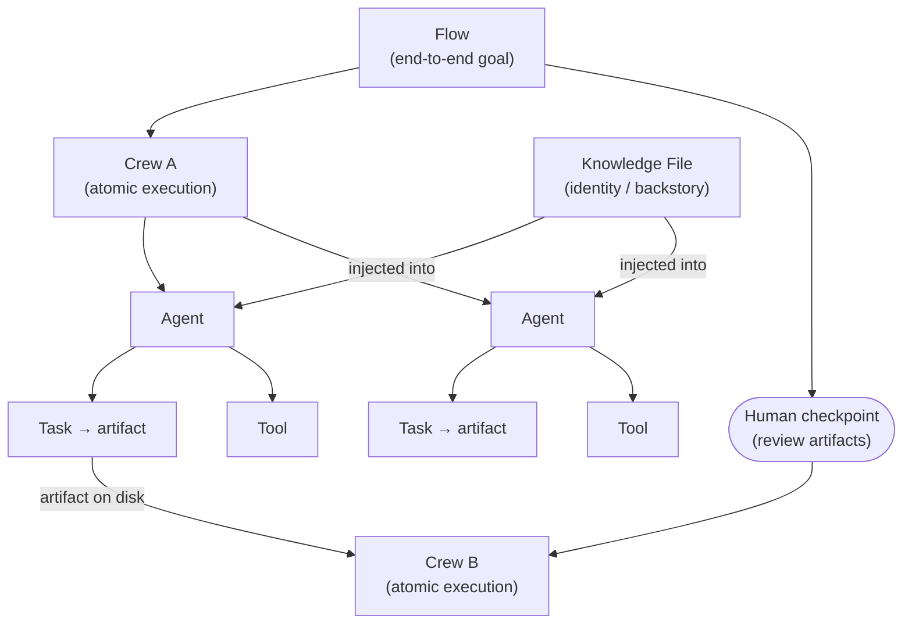
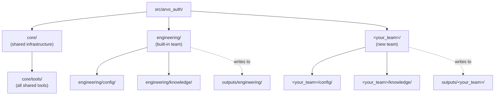

# Arvo Auth CrewAI

Python package with **CrewAI console entry points** for the Arvo workspace. Automates software development lifecycle workflows.

*Documentação em Português: [README.pt-BR.md](README.pt-BR.md)*

---

## Prerequisites

- Python `>=3.10,<3.14`
- [uv](https://docs.astral.sh/uv/) (recommended) or `pip`
- Either **`ANTHROPIC_API_KEY`** (API mode) or the **`claude`** CLI in `PATH` (CLI mode)

---

## Install

```bash
cp .env.example .env
# Edit .env — set API key and/or Claude Code CLI vars; add Notion vars for Notion flows
crewai install
# or: uv sync
```

---

## LLM Backend

Agent LLM routing is controlled by `ARVO_LLM_BACKEND` and `ANTHROPIC_API_KEY`:

| Value | Behavior |
| --- | --- |
| `anthropic` (default when key is set) | CrewAI uses Anthropic HTTP API (`MODEL`, `ANTHROPIC_MAX_TOKENS`) |
| `claude_code` (default when key is unset) | Each agent step runs `claude -p` (same binary as Notion delegation) |

Set `ARVO_LLM_BACKEND=claude_code` to force CLI mode even if `ANTHROPIC_API_KEY` is present.

CLI mode options: `CLAUDE_CODE_BIN`, `ARVO_CREWAI_CLAUDE_CODE_TIMEOUT_SEC`, `ARVO_CLAUDE_CODE_CONTEXT_WINDOW`, `ARVO_CLAUDE_CODE_MODEL_LABEL`.

---

## Core Concepts

Understanding these entities is essential to use the tool correctly.



### Agent

An autonomous AI unit with a defined **role**, **goal**, and **backstory** (identity). Each agent reasons independently, selects which tools to invoke, and produces an output for its assigned task. Agents do not share state directly — they communicate through task outputs.

### Task

A discrete unit of work assigned to a specific agent. Each task has a description, an expected output, and writes an artifact to disk (e.g. `SRS.md`, `notion_changes_diff.md`). Tasks run sequentially within a crew; the output of one task is available as context to the next.

### Tool

A capability that an agent can invoke during task execution. Tools in this project handle concrete side effects: reading files from disk, calling the Notion REST API, or delegating actions to a `claude -p` subprocess via MCP. Agents decide autonomously when and how to use them.

### Knowledge File

A markdown file injected into an agent's backstory at startup (e.g. `engineering/knowledge/srs_author_identity.md`). It shapes the agent's identity, constraints, and decision-making style without being a task prompt. Changing a knowledge file changes how the agent behaves across all tasks it runs.

### Crew

An orchestrated, self-contained group of agents and tasks that runs to completion as a single unit. One CLI command = one crew. A crew has no external dependencies on other crews at runtime — it only reads from disk and writes to disk. Crews are the **unit of execution** in this tool.

### Flow

A user-level sequence of crew commands that together achieve an end-to-end goal. Flows are not a runtime construct — they are a coordination pattern where the output artifacts of one crew become the input artifacts of the next. The user is responsible for running each step in order and reviewing intermediate outputs before proceeding.

**Key distinction:** a crew is a single atomic execution; a flow is a multi-step process that requires human checkpoints between crews.

```
Flow: SRS Authoring → Notion Publish
  └─ Step 1: uv run run_srs          → outputs/srs_workflow/SRS.md
  └─ Step 2: uv run run_notion_publish  ← reads SRS.md → publishes to Notion
```

```
Flow: Meeting-Driven SRS Update
  └─ Step 1: uv run run_srs_meeting_update  → notion_changes_diff.md
  └─ [human review of diff]
  └─ Step 2: uv run run_srs_notion_diff_apply   (or run_srs_meeting_update_apply)
```

To create a new flow: [docs/como-criar-um-flow.md](docs/como-criar-um-flow.md) *(pt-BR)*

---

## Multi-Team Organization

The package is structured around **teams**. Each team owns an isolated directory containing its crews, config YAMLs, knowledge files, and outputs.



### Adding a new team

1. Create the team directory and required subdirectories:

```bash
mkdir -p src/arvo_auth/<team_name>/config
mkdir -p src/arvo_auth/<team_name>/knowledge
touch src/arvo_auth/<team_name>/__init__.py
```

2. Write crew files inside `src/arvo_auth/<team_name>/`, following the same `@CrewBase` pattern used in `engineering/`. Config YAMLs go in `<team_name>/config/`, identity files in `<team_name>/knowledge/`.

3. Name output files under `outputs/<team_name>/` to keep artifacts isolated:

```python
output_file="outputs/<team_name>/my_workflow/result.md"
```

4. Register entry points in `src/arvo_auth/main.py` and `pyproject.toml`:

```python
# main.py
def run_my_team_flow():
    from arvo_auth.<team_name>.my_crew import MyCrew
    MyCrew().crew().kickoff(inputs={...})
```

```toml
# pyproject.toml
[project.scripts]
run_my_team_flow = "arvo_auth.main:run_my_team_flow"
```

### Reusing flows from another team

Crew classes are standard Python — import and use them directly. All tools in `core/tools/` are available to every team.

**Run an existing crew as-is:**

```python
from arvo_auth.engineering.srs_crew import SrsAuthorCrew

SrsAuthorCrew().crew().kickoff(inputs={...})
```

**Subclass to override config or knowledge files:**

```python
from arvo_auth.engineering.srs_crew import SrsAuthorCrew

class MyTeamSrsCrew(SrsAuthorCrew):
    agents_config = "config/my_srs_agents.yaml"   # team-specific prompts
    tasks_config  = "config/my_srs_tasks.yaml"
```

**Use a shared tool in a new crew:**

```python
from arvo_auth.core.tools.workflow_output_read_tool import WorkflowOutputReadTool
from arvo_auth.core.llm_defaults import default_llm
```

---

## Crews

### Engineering team

| Command | Crew | Purpose | Docs |
| --- | --- | --- | --- |
| `crewai run` | `ArvoAuthOrchestrator` | SDLC pipeline: planning → maintenance readiness | [crew-sdlc-pipeline.md](docs/crews/crew-sdlc-pipeline.md) |
| `uv run run_srs` | `SrsAuthorCrew` | Product overview → artifacts → `SRS.md` | [crew-srs-author.md](docs/crews/crew-srs-author.md) |
| `uv run run_srs_replay` | `SrsAuthorCrew` | Replay from a stored task (e.g. regenerate `SRS.md` only) | [crew-srs-author.md](docs/crews/crew-srs-author.md) |
| `uv run run_notion_publish` | `SrsNotionPublishCrew` | `SRS.md` → Notion page tree (Claude Code CLI + MCP) | [crew-srs-notion-publish.md](docs/crews/crew-srs-notion-publish.md) |
| `uv run run_notion_gap_comments` | `NotionGapCommentCrew` | Active gaps/conflicts → Notion search + inline comments | [crew-notion-gap-comments.md](docs/crews/crew-notion-gap-comments.md) |
| `uv run run_srs_meeting_update` | `SrsMeetingChangesPlanCrew` | Transcript + Notion comment scan → `notion_changes_diff.md` | [crew-srs-meeting-update.md](docs/crews/crew-srs-meeting-update.md) |
| `uv run run_srs_meeting_update_apply` | `SrsMeetingChangesApplyCrew` | Apply diff via MCP + bump Versions in SRS and Notion | [crew-srs-meeting-update.md](docs/crews/crew-srs-meeting-update.md) |
| `uv run run_srs_notion_diff_apply` | `SrsNotionDiffApplyCrew` | Apply diff to Notion only (no Versions update) | [crew-srs-notion-diff-apply.md](docs/crews/crew-srs-notion-diff-apply.md) |
| `uv run run_service_handover` | `ServiceHandoverCrew` | Service directory + memory-bank + git log → `<service>_handover.md` (paused-service runbook). Reusable by any team. | [crew-service-handover.md](docs/crews/crew-service-handover.md) |

### Data science team

| Command | Crew | Purpose | Docs |
| --- | --- | --- | --- |
| `uv run run_ds_experiment_spec` | `ExperimentSpecCrew` | Discovery PDF + Arvo repos → `experiment_spec.md` | [crew-ds-experiment-spec.md](docs/crews/crew-ds-experiment-spec.md) |
| _(planned)_ `uv run run_ds_solution_architecture` | `SolutionArchitectureCrew` | Validated `experiment_spec.md` → `solution_architecture.md` (production design) | [crew-ds-solution-architecture.md](docs/crews/crew-ds-solution-architecture.md) |
| _(planned)_ `uv run run_ds_linear_sync` | `LinearSyncCrew` | Any spec markdown → granular Linear issues via MCP | [crew-ds-linear-sync.md](docs/crews/crew-ds-linear-sync.md) |

Per-crew documentation (agents, artifacts, env vars, Mermaid flows): [docs/README.md](docs/README.md).

---

## Typical Workflows

### SDLC Planning

```bash
crewai run
```

### SRS Authoring → Notion Publish

```bash
uv run run_srs
uv run run_notion_publish
```

### Meeting-Driven SRS Update

```bash
uv run run_srs_meeting_update -- /path/to/transcript.md
# Review outputs/engineering/srs_meeting_update/notion_changes_diff.md, then:
uv run run_srs_notion_diff_apply          # Notion only
# or:
uv run run_srs_meeting_update_apply       # Notion + Versions bump
```

---

## Project Layout

```
arvo_auth_orchestrator/
├── outputs/                              # Runtime artifacts (gitignored)
│   └── engineering/                      # Namespaced per team
│       ├── srs_workflow/
│       ├── notion_export/
│       ├── notion_gap_comments/
│       └── srs_meeting_update/
├── src/arvo_auth/
│   ├── main.py                           # CLI entry points
│   ├── core/                             # Shared infrastructure
│   │   ├── llm_defaults.py               # LLM backend routing
│   │   ├── claude_code_llm.py            # CrewAI BaseLLM → `claude -p`
│   │   ├── crewai_react_parse_fix.py     # ReAct output parsing fix
│   │   └── tools/                        # All shared tools (file I/O, Notion REST/MCP)
│   └── engineering/                      # Engineering team flows
│       ├── config/                       # agents.yaml + tasks.yaml per crew
│       ├── knowledge/                    # Agent identity and authoring rules files
│       ├── crew.py                       # ArvoAuthOrchestrator (SDLC)
│       ├── srs_crew.py                   # SrsAuthorCrew
│       ├── notion_publish_crew.py        # SrsNotionPublishCrew
│       ├── notion_gap_comment_crew.py    # NotionGapCommentCrew
│       ├── srs_meeting_update_crew.py    # SrsMeetingChangesPlanCrew + ApplyCrew
│       └── srs_notion_diff_apply_crew.py # SrsNotionDiffApplyCrew
├── docs/                                 # Documentation
│   └── crews/
├── .env.example
└── pyproject.toml
```

---

## Troubleshooting

| Issue | Mitigation |
| --- | --- |
| `onnxruntime` / platform errors on `uv sync` | `[tool.uv] override-dependencies` in `pyproject.toml`; adjust pin if needed. |
| `unable to open database file` (CrewAI SQLite) | Set `ARVO_CREWAI_IN_PROJECT_HOME=1` — state lives under `.crewai_runtime_home/`. |
| Notion 400 on create page | Confirm integration has access to `NOTION_SRS_PARENT_PAGE_ID`; check title property name vs. workspace locale. |
| Notion 403 on `run_notion_gap_comments` | Enable **insert comment** and **search** capabilities for the integration; verify `NOTION_API_KEY`. |

---

## References

- [CrewAI documentation](https://docs.crewai.com/)
- [CrewAI LLMs / Anthropic](https://docs.crewai.com/en/concepts/llms)
- [Notion API — Create a page](https://developers.notion.com/reference/post-page)
