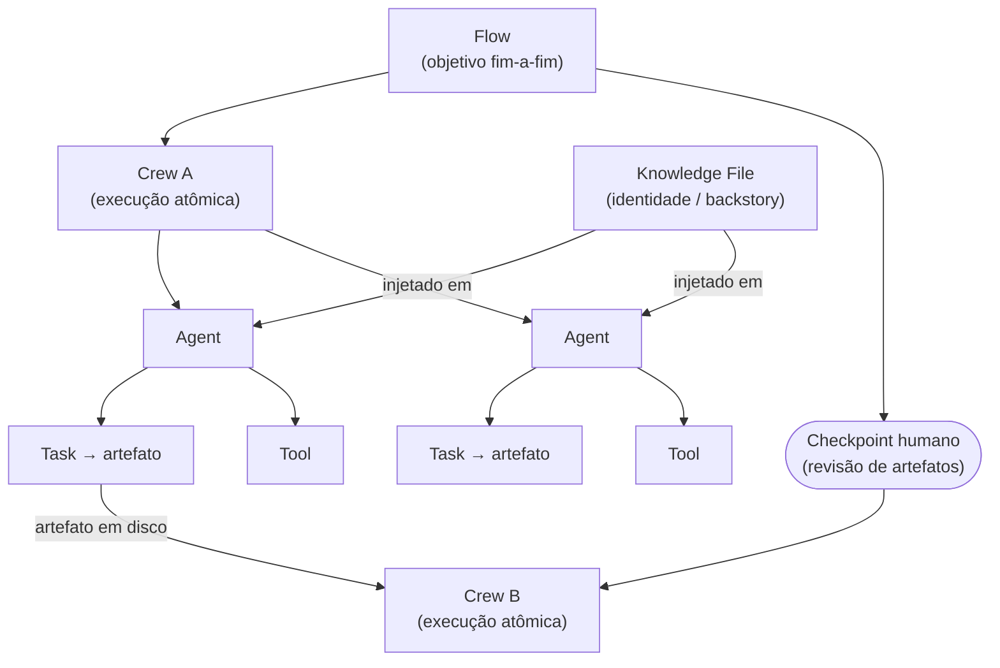
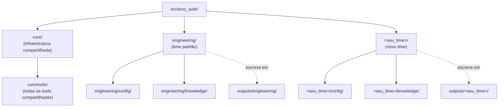

# Arvo Auth CrewAI

Pacote Python com **comandos CrewAI** para o workspace Arvo. Automatiza fluxos do ciclo de vida de desenvolvimento de software.

*English version: [README.md](README.md)*

---

## Pré-requisitos

- Python `>=3.10,<3.14`
- [uv](https://docs.astral.sh/uv/) (recomendado) ou `pip`
- **`ANTHROPIC_API_KEY`** (modo API) ou CLI **`claude`** no `PATH` (modo CLI)

---

## Instalação

```bash
cp .env.example .env
# Edite o .env — chave API e/ou Claude Code CLI; variáveis Notion para fluxos Notion
crewai install
# ou: uv sync
```

---

## LLM Backend

O roteamento do LLM dos agentes usa `ARVO_LLM_BACKEND` e `ANTHROPIC_API_KEY`:

| Valor | Comportamento |
| --- | --- |
| `anthropic` (padrão quando a chave está definida) | CrewAI chama a API HTTP Anthropic (`MODEL`, `ANTHROPIC_MAX_TOKENS`) |
| `claude_code` (padrão quando a chave não está definida) | Cada passo do agente executa `claude -p` (mesmo binário da delegação Notion) |

Defina `ARVO_LLM_BACKEND=claude_code` para forçar o modo CLI mesmo com `ANTHROPIC_API_KEY` presente.

Opções do modo CLI: `CLAUDE_CODE_BIN`, `ARVO_CREWAI_CLAUDE_CODE_TIMEOUT_SEC`, `ARVO_CLAUDE_CODE_CONTEXT_WINDOW`, `ARVO_CLAUDE_CODE_MODEL_LABEL`.

---

## Conceitos Fundamentais

Compreender estas entidades é essencial para utilizar a ferramenta corretamente.



### Agent (Agente)

Unidade de IA autônoma com **papel**, **objetivo** e **backstory** (identidade) definidos. Cada agente raciocina de forma independente, decide quais ferramentas invocar e produz uma saída para a tarefa que lhe foi atribuída. Agentes não compartilham estado diretamente — comunicam-se através dos artefatos gerados pelas tarefas.

### Task (Tarefa)

Unidade discreta de trabalho atribuída a um agente específico. Cada tarefa possui uma descrição, uma saída esperada e grava um artefato em disco (ex: `SRS.md`, `notion_changes_diff.md`). As tarefas executam sequencialmente dentro de um crew; a saída de uma tarefa fica disponível como contexto para a próxima.

### Tool (Ferramenta)

Capacidade que um agente pode invocar durante a execução de uma tarefa. As ferramentas neste projeto lidam com efeitos colaterais concretos: leitura de arquivos em disco, chamadas à API REST do Notion ou delegação de ações a um subprocesso `claude -p` via MCP. Os agentes decidem autonomamente quando e como utilizá-las.

### Knowledge File (Arquivo de Identidade)

Arquivo markdown injetado no backstory de um agente na inicialização (ex: `engineering/knowledge/srs_author_identity.md`). Define a identidade, restrições e estilo de tomada de decisão do agente — não é um prompt de tarefa. Alterar um knowledge file muda o comportamento do agente em todas as tarefas que ele executa.

### Crew

Grupo orquestrado e autocontido de agentes e tarefas que executa até a conclusão como uma unidade única. Um comando CLI = um crew. Um crew não possui dependências externas de outros crews em tempo de execução — apenas lê e escreve em disco. Crews são a **unidade de execução** desta ferramenta.

### Flow (Fluxo)

Sequência de comandos de crew que, juntos, alcançam um objetivo fim-a-fim. Flows não são um construto de runtime — são um padrão de coordenação onde os artefatos de saída de um crew se tornam os artefatos de entrada do próximo. O usuário é responsável por executar cada etapa na ordem correta e revisar os artefatos intermediários antes de prosseguir.

**Distinção fundamental:** um crew é uma execução atômica única; um flow é um processo de múltiplas etapas que requer checkpoints humanos entre os crews.

```
Flow: Autoria SRS → Publicação no Notion
  └─ Etapa 1: uv run run_srs              → outputs/srs_workflow/SRS.md
  └─ Etapa 2: uv run run_notion_publish   ← lê SRS.md → publica no Notion
```

```
Flow: Atualização SRS por Reunião
  └─ Etapa 1: uv run run_srs_meeting_update  → notion_changes_diff.md
  └─ [revisão humana do diff]
  └─ Etapa 2: uv run run_srs_notion_diff_apply   (ou run_srs_meeting_update_apply)
```

Para criar um novo flow: [docs/como-criar-um-flow.md](docs/como-criar-um-flow.md)

---

## Organização Multi-Times

O pacote é estruturado em torno de **times**. Cada time possui um diretório isolado com seus crews, configs YAML, knowledge files e outputs.



### Criando um novo time

1. Crie o diretório do time e os subdiretórios necessários:

```bash
mkdir -p src/arvo_auth/<nome_do_time>/config
mkdir -p src/arvo_auth/<nome_do_time>/knowledge
touch src/arvo_auth/<nome_do_time>/__init__.py
```

2. Crie os crew files dentro de `src/arvo_auth/<nome_do_time>/`, seguindo o padrão `@CrewBase` usado em `engineering/`. Configs YAML ficam em `<nome_do_time>/config/`, identity files em `<nome_do_time>/knowledge/`.

3. Nomeie os artefatos de saída sob `outputs/<nome_do_time>/` para manter os outputs isolados:

```python
output_file="outputs/<nome_do_time>/meu_workflow/resultado.md"
```

4. Registre os entry points em `src/arvo_auth/main.py` e `pyproject.toml`:

```python
# main.py
def run_meu_time_flow():
    from arvo_auth.<nome_do_time>.meu_crew import MeuCrew
    MeuCrew().crew().kickoff(inputs={...})
```

```toml
# pyproject.toml
[project.scripts]
run_meu_time_flow = "arvo_auth.main:run_meu_time_flow"
```

### Reutilizando flows de outro time

Classes de crew são Python puro — importe e use diretamente. Todas as tools em `core/tools/` estão disponíveis para todos os times.

**Executar um crew existente diretamente:**

```python
from arvo_auth.engineering.srs_crew import SrsAuthorCrew

SrsAuthorCrew().crew().kickoff(inputs={...})
```

**Subclassear para sobrescrever configs ou knowledge files:**

```python
from arvo_auth.engineering.srs_crew import SrsAuthorCrew

class MeuTimeSrsCrew(SrsAuthorCrew):
    agents_config = "config/meu_srs_agents.yaml"   # prompts específicos do time
    tasks_config  = "config/meu_srs_tasks.yaml"
```

**Usar uma tool compartilhada em um novo crew:**

```python
from arvo_auth.core.tools.workflow_output_read_tool import WorkflowOutputReadTool
from arvo_auth.core.llm_defaults import default_llm
```

---

## Crews

### Time de engenharia

| Comando | Crew | Finalidade | Docs |
| --- | --- | --- | --- |
| `crewai run` | `ArvoAuthOrchestrator` | Pipeline SDLC: planejamento → prontidão para manutenção | [crew-sdlc-pipeline.md](docs/crews/crew-sdlc-pipeline.md) |
| `uv run run_srs` | `SrsAuthorCrew` | Visão de produto → artefatos → `SRS.md` | [crew-srs-author.md](docs/crews/crew-srs-author.md) |
| `uv run run_srs_replay` | `SrsAuthorCrew` | Replay a partir de tarefa gravada (p.ex. só o passo 7) | [crew-srs-author.md](docs/crews/crew-srs-author.md) |
| `uv run run_notion_publish` | `SrsNotionPublishCrew` | `SRS.md` → hierarquia no Notion (CLI `claude` + MCP) | [crew-srs-notion-publish.md](docs/crews/crew-srs-notion-publish.md) |
| `uv run run_notion_gap_comments` | `NotionGapCommentCrew` | Lacunas/conflitos → pesquisa + comentários inline no Notion | [crew-notion-gap-comments.md](docs/crews/crew-notion-gap-comments.md) |
| `uv run run_srs_meeting_update` | `SrsMeetingChangesPlanCrew` | Transcrição + varredura de comentários Notion → `notion_changes_diff.md` | [crew-srs-meeting-update.md](docs/crews/crew-srs-meeting-update.md) |
| `uv run run_srs_meeting_update_apply` | `SrsMeetingChangesApplyCrew` | Aplicar diff via MCP + atualizar Versões no SRS e no Notion | [crew-srs-meeting-update.md](docs/crews/crew-srs-meeting-update.md) |
| `uv run run_srs_notion_diff_apply` | `SrsNotionDiffApplyCrew` | Aplicar diff no Notion apenas (sem atualização de Versões) | [crew-srs-notion-diff-apply.md](docs/crews/crew-srs-notion-diff-apply.md) |
| `uv run run_service_handover` | `ServiceHandoverCrew` | Diretório do serviço + memory-bank + git log → `<service>_handover.md` (runbook de serviço pausado). Reutilizável por qualquer time. | [crew-service-handover.md](docs/crews/crew-service-handover.md) |

### Time de data science

| Comando | Crew | Finalidade | Docs |
| --- | --- | --- | --- |
| `uv run ds_run_experiment_spec` | `ExperimentSpecCrew` | PDF de descoberta + repos Arvo → `experiment_spec.md` | [crew-ds-experiment-spec.md](docs/crews/crew-ds-experiment-spec.md) |
| _(planejado)_ `uv run ds_run_solution_architecture` | `SolutionArchitectureCrew` | `experiment_spec.md` validado → `solution_architecture.md` (desenho de produção) | [crew-ds-solution-architecture.md](docs/crews/crew-ds-solution-architecture.md) |
| _(planejado)_ `uv run ds_run_linear_sync` | `LinearSyncCrew` | Qualquer spec em markdown → issues granulares no Linear via MCP | [crew-ds-linear-sync.md](docs/crews/crew-ds-linear-sync.md) |

Documentação detalhada por crew (agentes, artefatos, variáveis, fluxos Mermaid): [docs/README.md](docs/README.md).

---

## Fluxos Típicos

### Pipeline SDLC

```bash
crewai run
```

### Autoria SRS → Publicação no Notion

```bash
uv run run_srs
uv run run_notion_publish
```

### Atualização SRS por reunião

```bash
uv run run_srs_meeting_update -- /caminho/para/transcript.md
# Após revisar outputs/engineering/srs_meeting_update/notion_changes_diff.md:
uv run run_srs_notion_diff_apply          # só Notion
# ou:
uv run run_srs_meeting_update_apply       # Notion + bump de Versões
```

---

## Layout do Projeto

```
arvo_auth_orchestrator/
├── outputs/                              # Artefatos em tempo de execução (gitignored)
│   └── engineering/                      # Namespace por time
│       ├── srs_workflow/
│       ├── notion_export/
│       ├── notion_gap_comments/
│       └── srs_meeting_update/
├── src/arvo_auth/
│   ├── main.py                           # Entry points CLI
│   ├── core/                             # Infraestrutura compartilhada
│   │   ├── llm_defaults.py               # Roteamento do LLM backend
│   │   ├── claude_code_llm.py            # CrewAI BaseLLM → `claude -p`
│   │   ├── crewai_react_parse_fix.py     # Correção do parser ReAct
│   │   └── tools/                        # Todas as tools compartilhadas
│   └── engineering/                      # Flows do time de engenharia
│       ├── config/                       # agents.yaml + tasks.yaml por crew
│       ├── knowledge/                    # Arquivos de identidade e regras dos agentes
│       ├── crew.py                       # ArvoAuthOrchestrator (SDLC)
│       ├── srs_crew.py                   # SrsAuthorCrew
│       ├── notion_publish_crew.py        # SrsNotionPublishCrew
│       ├── notion_gap_comment_crew.py    # NotionGapCommentCrew
│       ├── srs_meeting_update_crew.py    # SrsMeetingChangesPlanCrew + ApplyCrew
│       └── srs_notion_diff_apply_crew.py # SrsNotionDiffApplyCrew
├── docs/                                 # Documentação
│   └── crews/
├── .env.example
└── pyproject.toml
```

---

## Solução de Problemas

| Problema | O que fazer |
| --- | --- |
| Erros de `onnxruntime` / plataforma no `uv sync` | `[tool.uv] override-dependencies` no `pyproject.toml`; ajuste o pin se necessário. |
| `unable to open database file` (SQLite do CrewAI) | Defina `ARVO_CREWAI_IN_PROJECT_HOME=1` — estado gravado em `.crewai_runtime_home/`. |
| Notion 400 ao criar página | Confirme acesso da integração a `NOTION_SRS_PARENT_PAGE_ID`; verifique nome da propriedade de título vs. idioma do workspace. |
| Notion 403 em `run_notion_gap_comments` | Ative capacidades de **comentário** e pesquisa na integração; confira `NOTION_API_KEY`. |

---

## Referências

- [Documentação CrewAI](https://docs.crewai.com/)
- [CrewAI — LLMs / Anthropic](https://docs.crewai.com/en/concepts/llms)
- [Notion API — Criar página](https://developers.notion.com/reference/post-page)
