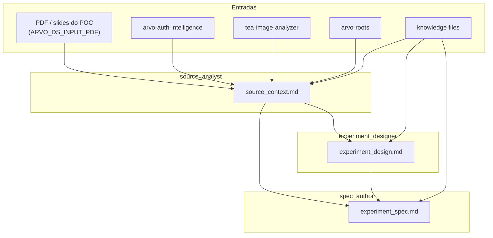

# Crew: spec de experimento DS (`ExperimentSpecCrew`)

## Identificação

| Campo | Valor |
| --- | --- |
| **Status** | Implementado |
| **Time** | `data_science` |
| **Classe** | `ExperimentSpecCrew` |
| **Ficheiro** | `src/arvo_auth/data_science/experiment_spec_crew.py` |
| **Configuração** | `config/experiment_spec_agents.yaml`, `config/experiment_spec_tasks.yaml` |
| **Processo** | Sequencial |
| **Comando** | `uv run ds_run_experiment_spec` |
| **Entrada em código** | `main.run_ds_experiment_spec()` |

## Objetivo

A partir de um **artefacto de descoberta** (ex.: PDF de análise manual, slides de POC) e do **estado atual do ecossistema Arvo** (repositórios de modelos, pipelines de dados, workflows downstream), produzir um **`experiment_spec.md`** que descreva o experimento de validação da nova capacidade — com hipótese, dados, métodos, métricas e roadmap em fases.

Não desenha arquitetura de produção (responsabilidade de [`SolutionArchitectureCrew`](crew-ds-solution-architecture.md)).

## O que faz

Três agentes sequenciais:

1. **Mapeamento de contexto** (`source_analyst`) — lê o PDF do POC (visão), os repositórios relevantes (`arvo-auth-intelligence`, `tea-image-analyzer`, `arvo-roots`) e produz `source_context.md` com (a) achados da análise manual, (b) estado do pipeline atual, (c) pontos de integração possíveis, (d) números preservados (saving, sample, sessões).
2. **Desenho científico** (`experiment_designer`) — propõe hipóteses testáveis, prior art, requisitos de dados, métodos a comparar (baseline vs principal), métricas, critérios de sucesso e riscos. Produz `experiment_design.md`.
3. **Consolidação editorial** (`spec_author`) — sintetiza os dois artefactos anteriores num `experiment_spec.md` apresentável a stakeholders (executive summary, problem, current state, approach, phased roadmap, metrics, risks, open questions).

## Agentes

| Agente | Ferramentas | Identidade em runtime |
| --- | --- | --- |
| **source_analyst** | `PresentationReadTool`, `ConfigurableRepoReadTool`, `BriefingFileReadTool` | `knowledge/ds_author_identity.md` |
| **experiment_designer** | `WorkflowOutputReadTool`, `BriefingFileReadTool` | `knowledge/ds_author_identity.md` + regras em `experiment_authoring_rules.md` |
| **spec_author** | `WorkflowOutputReadTool`, `BriefingFileReadTool` | `knowledge/ds_author_identity.md` + regras em `experiment_authoring_rules.md` |

## Artefactos necessários para a execução

### Entrada humana / env (kickoff)

| Variável | Obrigatório | Descrição |
| --- | --- | --- |
| `ARVO_DS_INPUT_PDF` | Sim | Caminho para o PDF do POC / artefacto de descoberta |
| `ARVO_DS_PROJECT_NAME` | Recomendado | Nome do projeto (interpolado em prompts) |
| `ARVO_DS_PHASE` | Recomendado | Fase (ex.: `poc_replication`, `mvp`) |
| `ARVO_DS_BRIEFING_MARKDOWN` | Opcional | Markdown extra anexado como contexto |
| `ARVO_REPO_INTELLIGENCE` | Opcional | Raiz do `arvo-auth-intelligence` (default: irmão do projeto) |
| `ARVO_REPO_TEA_ANALYZER` | Opcional | Raiz do `tea-image-analyzer` |
| `ARVO_REPO_ROOTS` | Opcional | Raiz do `arvo-roots` |
| `ARVO_DS_RULES_FILE` | Opcional | Nome do ficheiro em `knowledge/` (default `experiment_authoring_rules.md`) |

### Ficheiros de conhecimento (projeto)

| Ficheiro | Uso |
| --- | --- |
| `data_science/knowledge/ds_author_identity.md` | Identidade do time DS aplicado a doc/image intelligence Arvo |
| `data_science/knowledge/experiment_authoring_rules.md` | Template do `experiment_spec.md` + regras de rigor estatístico, reprodutibilidade, business framing |

### Infraestrutura

| Requisito | Notas |
| --- | --- |
| LLM | `default_llm()` — `ARVO_LLM_BACKEND=claude_code` recomendado para leitura do PDF via visão |
| Claude Code CLI | Obrigatório se backend = `claude_code` ou se `PresentationReadTool` for invocada |
| Repos | Pastas apontadas por `ARVO_REPO_*` ou defaults irmãos |

### Diretório de saída

- `outputs/data_science/experiment_spec/` criado por `run_ds_experiment_spec()` antes do `kickoff`.

### Saídas geradas pelo crew

| Ficheiro | Passo |
| --- | --- |
| `outputs/data_science/experiment_spec/source_context.md` | 1 |
| `outputs/data_science/experiment_spec/experiment_design.md` | 2 |
| `outputs/data_science/experiment_spec/experiment_spec.md` | 3 (artefacto final) |

## Diagrama de fluxo (Mermaid)

## Continuação do fluxo

Após revisão humana de `experiment_spec.md`:

- Para **desenhar arquitetura de produção** → [`SolutionArchitectureCrew`](crew-ds-solution-architecture.md)
- Para **criar issues no Linear** a partir do spec → [`LinearSyncCrew`](crew-ds-linear-sync.md)
- Para **publicar no Notion** → reutilizar `SrsNotionPublishCrew` apontando ao novo artefacto

## Referências no repositório

- Tarefas: `src/arvo_auth/data_science/config/experiment_spec_tasks.yaml`
- Agentes: `src/arvo_auth/data_science/config/experiment_spec_agents.yaml`
- Crew: `src/arvo_auth/data_science/experiment_spec_crew.py`
- Entrada e montagem de inputs: `src/arvo_auth/main.py` (`run_ds_experiment_spec`, `_build_ds_experiment_spec_inputs`)
- Tools compartilhadas:
  - `src/arvo_auth/core/tools/presentation_read_tool.py`
  - `src/arvo_auth/core/tools/configurable_repo_read_tool.py`
