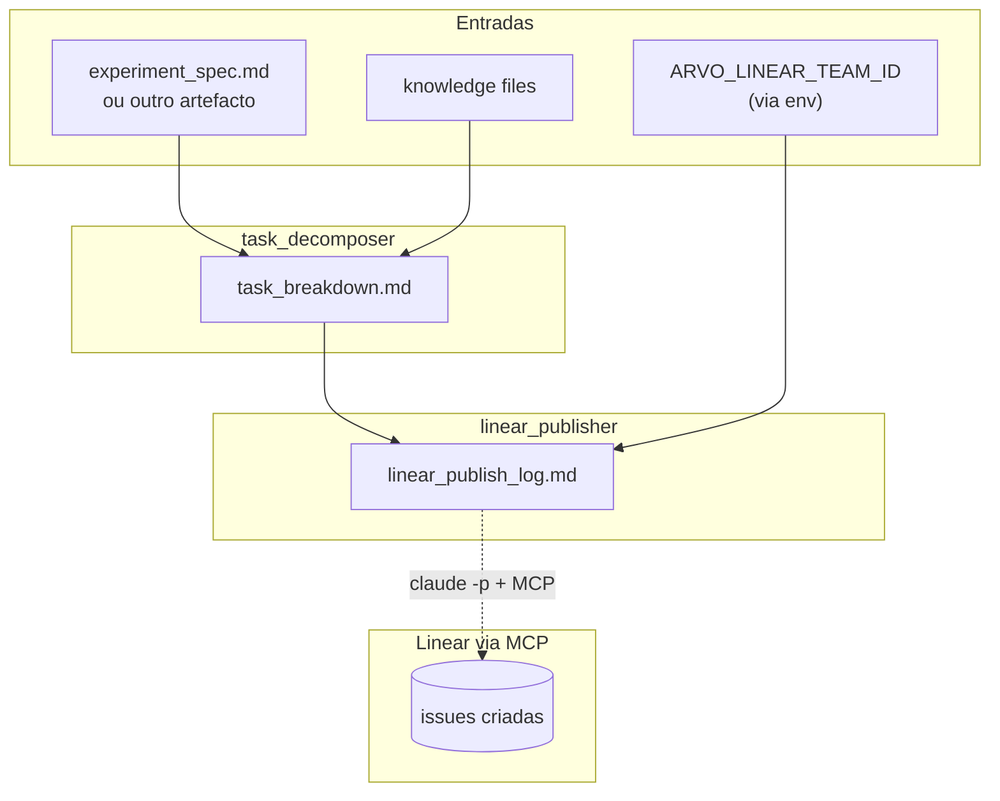

# Crew: sincronização com Linear (`LinearSyncCrew`)

> **Status:** `PLANNED` — design v1, implementação pendente. Será construído depois do `ExperimentSpecCrew` validar em prática.
>
> **Atualização (2026-05-26):** engineering tem `LinearTasksCreationCrew` em construção em `origin/feat/linear-tasks-creation` (não mergeado ainda). Quando mergear, este design deve ser **revisitado** para: (a) verificar se a tool de delegação (provavelmente `LinearClaudeDelegate` ou equivalente) já está em `core/tools/` e pode ser reutilizada direto; (b) divergir só onde DS tem necessidade diferente (granularidade de tickets, labels, schema do `task_breakdown.md`); (c) avaliar se vale fundir as duas implementações ou manter dois crews paralelos (`LinearTasksCreationCrew` para engineering ↔ `LinearSyncCrew` para DS).

## Identificação

| Campo | Valor |
| --- | --- |
| **Status** | Planned |
| **Time** | `data_science` (mas tool subjacente em `core/tools/` para reuso) |
| **Classe** (futura) | `LinearSyncCrew` |
| **Ficheiro** (futuro) | `src/arvo_auth/data_science/linear_sync_crew.py` |
| **Configuração** (futura) | `config/linear_sync_agents.yaml`, `config/linear_sync_tasks.yaml` |
| **Processo** | Sequencial |
| **Comando** (futuro) | `uv run ds_run_linear_sync` (opcionalmente `-- /path/para/outro.md`) |
| **Entrada em código** (futura) | `main.run_ds_linear_sync()` |

## Objetivo

Dado um artefacto markdown (típico: `experiment_spec.md`), **quebrar em tarefas granulares** (1 ticket = 1 tarefa) e **criar como issues no Linear** via MCP, com idempotência (não duplica se rodar 2x).

## O que vai fazer

Dois agentes sequenciais:

1. **Decomposição** (`task_decomposer`) — lê o artefacto, identifica tarefas granulares com título, descrição, acceptance criteria, labels sugeridos, dependências. Produz `task_breakdown.md`.
2. **Publicação** (`linear_publisher`) — lê o breakdown e cria issues no Linear via `LinearClaudeDelegate` (tool que delega ao `claude -p` com MCP Linear). Produz `linear_publish_log.md` com URLs criadas para auditoria.

## Agentes (planejados)

| Agente | Ferramentas | Identidade em runtime |
| --- | --- | --- |
| **task_decomposer** | `WorkflowOutputReadTool`, `BriefingFileReadTool` | `knowledge/task_decomposer_identity.md` (a criar) |
| **linear_publisher** | `LinearClaudeDelegate` (nova tool em `core/tools/`), `WorkflowOutputReadTool` | `knowledge/linear_publisher_identity.md` (a criar) |

## Tool nova a criar: `LinearClaudeDelegate`

| Aspecto | Detalhe |
| --- | --- |
| **Localização** | `src/arvo_auth/core/tools/linear_claude_delegate.py` |
| **Padrão de design** | Espelho exato de `notion_claude_delegate.py` (delegação a `claude -p` com MCP) |
| **Razão** | MCP Linear roda no Claude Code, não no Python do CrewAI. Subprocesso `claude -p` é a ponte. |
| **Função pública** | `create_linear_issues_via_claude(team_id, project_id, issues, dry_run)` |

## Artefactos necessários (planejados)

### Entrada humana / env (kickoff)

| Variável | Obrigatório | Descrição |
| --- | --- | --- |
| `ARVO_LINEAR_TEAM_ID` | Sim | ID do team no Linear onde criar as issues |
| `ARVO_LINEAR_DEFAULT_PROJECT_ID` | Opcional | Project ID padrão (caso queira agrupar issues) |
| `ARVO_LINEAR_DEFAULT_LABELS` | Opcional | Labels separadas por vírgula (ex.: `experiment,data-science`) |
| `ARVO_LINEAR_DRY_RUN` | Opcional | `1` = só loga o que faria, não cria nada |
| `ARVO_DS_LINEAR_INPUT_PATH` | Opcional | Path do artefacto de entrada. Default: `outputs/data_science/experiment_spec/experiment_spec.md` |

Path pode também ser passado como primeiro argumento CLI: `uv run ds_run_linear_sync -- /caminho/para/spec.md`.

### Saídas planejadas

| Ficheiro | Passo |
| --- | --- |
| `outputs/data_science/linear_sync/task_breakdown.md` | 1 |
| `outputs/data_science/linear_sync/linear_publish_log.md` | 2 (URLs + IDs para auditoria) |

## Estratégia de idempotência

**Problema:** rodar 2x não pode duplicar issues.

**Solução:**

1. **Marker no description**: cada issue criada inclui no final do description um HTML comment marker:
   ```html
   <!-- arvo-crewai:spec-sha=<hash-do-spec> | task-id=<slug> -->
   ```
2. **Busca antes de criar**: `linear_publisher` antes de criar busca issues do team com o `spec-sha` no description; se já existir, **pula** (ou opcionalmente **atualiza** se conteúdo mudou — comportamento futuro).
3. **Log de duplicatas**: `linear_publish_log.md` distingue `created` vs `skipped (already exists)`.

## Estrutura esperada do `task_breakdown.md` (intermediário)

YAML/markdown estruturado para o publisher consumir:

```markdown
## Task 1: Coletar amostra rotulada de assinaturas
- **Labels**: data, experiment
- **Description**: ...
- **Acceptance criteria**: ...
- **Depends on**: (none)

## Task 2: Implementar baseline de features grafotécnicas
- **Labels**: experiment, baseline
- **Depends on**: Task 1
...
```

## Diagrama de fluxo (Mermaid)



## Por que dois agentes (e não um)

Separar **decidir o que** das **operações destrutivas** (criar 30 issues no Linear de uma agência inteira).

Workflow:

1. Roda só o `task_decomposer` → revisa o `task_breakdown.md`
2. Se ok → roda o `linear_publisher`
3. Se não ok → edita o markdown manualmente, depois roda só o publisher

CrewAI permite isso via `task_id` no replay — mesmo padrão do `run_srs_replay` do engineering.

## Reuso por outros times

Quando engenharia ou outro time quiser sincronizar SRSs/specs com Linear:

1. Copiar `data_science/linear_sync_crew.py` para `<time>/linear_sync_crew.py`
2. Adaptar prompts do `task_decomposer` para o formato do spec do time
3. Reusar `LinearClaudeDelegate` direto de `core/tools/` (sem mudança)
4. Reusar a estratégia de marker para idempotência

## Decisões em aberto

| Decisão | Adiada porque |
| --- | --- |
| Suporte a atualização de issues existentes (não só criar) | Aumenta complexidade; primeiro validar caso simples (create-only) |
| Sincronização de status (issue Linear → marcar como done no markdown) | Direção bidirecional pode esperar; pull-only para começar |
| Vincular a Cycles do Linear | Depende de como o time DS vai usar cycles |
| Suporte a sub-issues / parent-child | Linear MCP suporta; mas o spec raramente tem hierarquia profunda |
