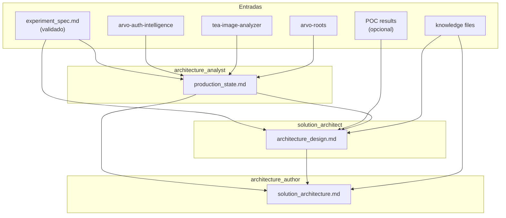

# Crew: arquitetura de solução DS (`SolutionArchitectureCrew`)

> **Status:** `PLANNED` — design v1, implementação pendente. Este documento preserva a decisão arquitetural; o código será gerado quando o `ExperimentSpecCrew` estiver validado em prática.

## Identificação

| Campo | Valor |
| --- | --- |
| **Status** | Planned |
| **Time** | `data_science` |
| **Classe** (futura) | `SolutionArchitectureCrew` |
| **Ficheiro** (futuro) | `src/arvo_auth/data_science/solution_architecture_crew.py` |
| **Configuração** (futura) | `config/solution_architecture_agents.yaml`, `config/solution_architecture_tasks.yaml` |
| **Processo** | Sequencial |
| **Comando** (futuro) | `uv run ds_run_solution_architecture` |
| **Entrada em código** (futura) | `main.run_ds_solution_architecture()` |

## Objetivo

Dado um `experiment_spec.md` **validado** (ou seja, o POC offline confirmou a hipótese central), desenhar a arquitetura de produção: onde a nova capacidade vai viver, quais schemas mudam, qual o plano de migração e quais os contratos de dados entre componentes.

Não inventa abordagem científica (responsabilidade de [`ExperimentSpecCrew`](crew-ds-experiment-spec.md)). Não cria issues no Linear (responsabilidade de [`LinearSyncCrew`](crew-ds-linear-sync.md)).

## O que vai fazer

Três agentes sequenciais:

1. **Mapeamento de produção** (`architecture_analyst`) — diferente do `source_analyst` do crew anterior. Foca em **schemas BigQuery, padrões de deploy, configs Cloud Run, padrões Mage de `workflows_v2`, parallelism em Vertex AI**. Lê `experiment_spec.md` + detalhes de produção. Produz `production_state.md`.
2. **Desenho de solução** (`solution_architect`) — propõe opções de integração (A: nova stage no `tea-image-analyzer`; B: serviço separado consumindo BQ; C: bloco Mage standalone), recomenda uma, define schema novo, contratos JSON, plano de migração Vertex→Mage, observabilidade, projeção de custo. Produz `architecture_design.md`.
3. **Consolidação editorial** (`architecture_author`) — sintetiza num documento de arquitetura formal com diagramas Mermaid, plano faseado, decisões em aberto. Produz `solution_architecture.md`.

## Agentes (planejados)

| Agente | Ferramentas | Identidade em runtime |
| --- | --- | --- |
| **architecture_analyst** | `ConfigurableRepoReadTool`, `WorkflowOutputReadTool`, `BriefingFileReadTool` | `knowledge/architecture_analyst_identity.md` (a criar) |
| **solution_architect** | `WorkflowOutputReadTool`, `BriefingFileReadTool` | `knowledge/solution_architect_identity.md` (a criar) |
| **architecture_author** | `WorkflowOutputReadTool`, `BriefingFileReadTool` | `knowledge/architecture_authoring_rules.md` (a criar) |

## Artefactos necessários (planejados)

### Entrada humana / env (kickoff)

| Variável | Obrigatório | Descrição |
| --- | --- | --- |
| `ARVO_DS_EXPERIMENT_SPEC_PATH` | Opcional | Path para o `experiment_spec.md`. Default: `outputs/data_science/experiment_spec/experiment_spec.md` |
| `ARVO_DS_POC_RESULTS_PATH` | Opcional | Path para resultados do POC offline (relatório, métricas, learnings) |
| `ARVO_REPO_INTELLIGENCE`, `ARVO_REPO_TEA_ANALYZER`, `ARVO_REPO_ROOTS` | Opcional | Mesmos do `ExperimentSpecCrew` |
| `ARVO_DS_PROJECT_NAME`, `ARVO_DS_PHASE` | Recomendado | Interpolação em prompts |

### Ficheiros de conhecimento a criar quando implementar

| Ficheiro | Uso |
| --- | --- |
| `knowledge/architecture_analyst_identity.md` | Voz: ML platform engineer; foco em produção, deploy, observabilidade |
| `knowledge/solution_architect_identity.md` | Voz: arquiteto de soluções; trade-offs explícitos, decisões reversíveis vs one-way |
| `knowledge/architecture_authoring_rules.md` | Template do `solution_architecture.md` + regras (sempre incluir Mermaid; sempre projetar custo; sempre rollback plan) |

### Saídas planejadas

| Ficheiro | Passo |
| --- | --- |
| `outputs/data_science/solution_architecture/production_state.md` | 1 |
| `outputs/data_science/solution_architecture/architecture_design.md` | 2 |
| `outputs/data_science/solution_architecture/solution_architecture.md` | 3 (artefacto final) |

## Estrutura esperada do `solution_architecture.md` final

```
1. Executive Summary (custo total, prazo, blast radius)
2. Context (resumo do experiment_spec validado + resultados POC)
3. Current Production State (resumo do production_state.md)
4. Integration Options (A, B, C com trade-offs)
5. Recommended Architecture (com diagrama Mermaid)
6. Data Contracts (schemas BigQuery, JSON entre serviços)
7. Migration Plan (Vertex→Mage, fases, breaking points, rollback)
8. Operational Concerns (deploy, monitoring, on-call, SLAs, cost)
9. Impact on Existing Systems (workflows_v2/filters/athena.py em específico)
10. Phased Rollout (canary, % de tráfego, gates)
11. Open Decisions (o que precisa de input de outros times)
```

## Diagrama de fluxo (Mermaid)



## Quando implementar

Quando pelo menos um `experiment_spec.md` real tiver passado por:

1. **Validação humana** — review e aprovação do design experimental
2. **POC executado** — experimento rodou offline, resultados disponíveis
3. **Decisão go/no-go** — time confirmou que vai para produção

Antes disso é prematuro: a arquitetura mudaria drasticamente conforme o que o POC revelar.

## Reuso por outros times

Quando engenharia ou outro time quiser adotar, o padrão é:

1. Copiar `data_science/solution_architecture_crew.py` para `<time>/solution_architecture_crew.py`
2. Adaptar prompts no YAML (linguagem do time, sistemas alvo)
3. Reusar tools de `core/tools/` sem alteração
