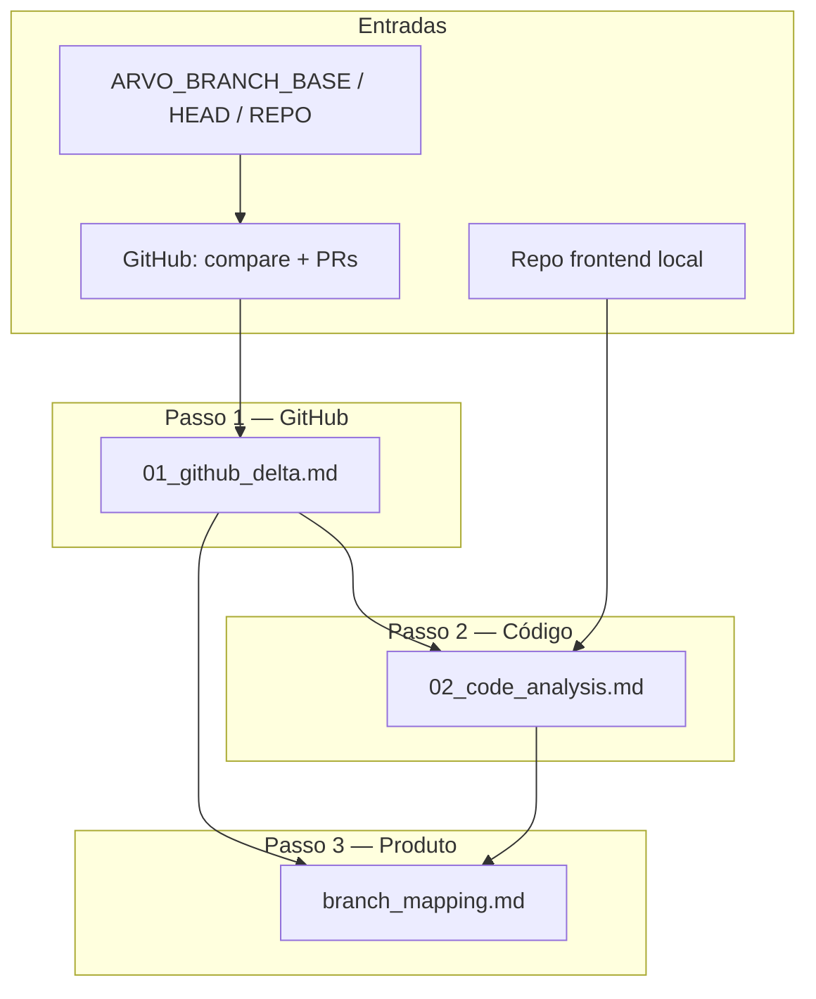

# Crew: mapeamento de branch frontend (`FrontendBranchMappingCrew`)

## Identificação

| Campo | Valor |
| --- | --- |
| **Classe** | `FrontendBranchMappingCrew` |
| **Ficheiro** | `src/arvo_auth/engineering/frontend_branch_mapping_crew.py` |
| **Configuração** | `src/arvo_auth/engineering/config/frontend_branch_mapping_agents.yaml`, `src/arvo_auth/engineering/config/frontend_branch_mapping_tasks.yaml` |
| **Processo** | Sequencial |
| **Comando** | `uv run run_frontend_branch_mapping` |
| **Entrada em código** | `arvo_auth.main.run_frontend_branch_mapping()` |

## Objetivo

Comparar duas branches do **repositório frontend** (Next.js) — uma de **origem** (`base_branch`, p.ex. `dev`) e uma **nova** (`head_branch`, p.ex. `TEA-M1`) — e produzir um **guia de validação orientado a produto/QA**, no estilo de `M1-mapping.md`: funcionalidades visíveis na branch nova que não existiam na origem, com rotas, passos no navegador, expectativas de UI e dependências de API.

O crew **não** substitui testes automatizados; gera um artefato para regressão manual pós-merge ou pré-release.

## O que faz

Um único agente (`frontend_branch_analyst`) executa **três passos**:

1. **Inventário GitHub** — `github_cli_query` com `branch_compare` (`{base_branch}...{head_branch}`), listagem de PRs da head e `pr_view` quando aplicável. Saída: `outputs/engineering/frontend_branch_mapping/01_github_delta.md` (commits, ficheiros agrupados por área, notas de PR).

2. **Revisão de código local** — `read_repo_file` no repo frontend para rotas (`src/app/**`), componentes e copy das áreas alteradas; distingue código montado vs módulos sem rota. Saída: `outputs/engineering/frontend_branch_mapping/02_code_analysis.md`.

3. **Artefato de produto** — Consolida os passos 1–2 num documento final em português (sem blocos de código), com secções numeradas, tabela “sem rota”, sanidade da branch base e checklist. Saída: `outputs/engineering/frontend_branch_mapping/branch_mapping.md`.

### Direção da comparação

A API GitHub usa `compare/{base}...{head}`: mostra o que está em **head** desde a divergência de **base** (commits e diff “à frente” da origem). Isto corresponde a “o que a branch nova implementou em relação à origem”.

Exemplo de referência de formato de saída (fora deste repo):  
`arvo-auth-frontend/M1-mapping.md` (TEA-M1 vs `dev`).

## Agente e ferramentas

| Agente | Ferramentas | Identidade em runtime |
| --- | --- | --- |
| **frontend_branch_analyst** | `GitHubCliTool`, `RepoReadTool`, `WorkflowOutputReadTool` | `src/arvo_auth/engineering/knowledge/frontend_branch_mapper_identity.md` (append ao backstory) |

### `github_cli_query` — operações usadas neste crew

| Operação | Parâmetros principais | Uso |
| --- | --- | --- |
| `branch_compare` | `repo`, `base_branch`, `head_branch` | Diff entre branches (ficheiros, commits, ahead/behind) |
| `pr_list` | `repo`, `branch` = head, `state` = all | PRs associados à branch nova |
| `pr_view` | `repo`, `number` | Título, corpo e ficheiros do PR |

Outras operações (`repo_view`, `api_get`, issues, Actions) existem na mesma tool mas não são obrigatórias neste fluxo.

### `read_workflow_artifact`

Para este crew, usar sempre `workflow_dir=frontend_branch_mapping` e um dos ficheiros:

- `01_github_delta.md`
- `02_code_analysis.md`
- `branch_mapping.md`

## Artefactos necessários para a execução

### Variáveis de ambiente (kickoff)

| Variável | Obrigatório | Descrição |
| --- | --- | --- |
| `ARVO_BRANCH_HEAD` | **Sim** | Branch nova / feature (p.ex. `TEA-M1`) |
| `ARVO_BRANCH_BASE` | Não | Branch origem (default `dev`) |
| `ARVO_FRONTEND_GITHUB_REPO` | Não | Repo `owner/name` no GitHub (p.ex. `arvo-health/arvo-auth-frontend`). Se vazio, tenta `gh repo view` em `ARVO_FRONTEND_REPO_ROOT`; senão default `arvo-health/arvo-auth-frontend` |
| `ARVO_FRONTEND_REPO_ROOT` | Recomendado | Caminho local do clone frontend para `read_repo_file` (default: irmão `arvo-auth-frontend`) |
| `ARVO_BRANCH_MAPPING_TITLE` | Não | Título do documento final (default `{head}-mapping`) |
| `ARVO_SRS_PROJECT_NAME` | Não | Interpolação no YAML (default `Arvo authorization`) |
| `GH_PATH` | Não | Caminho explícito do binário `gh` se não estiver no `PATH` |

### Ficheiros de conhecimento (projeto)

| Ficheiro | Uso |
| --- | --- |
| `src/arvo_auth/engineering/knowledge/frontend_branch_mapper_identity.md` | Missão, disciplina de tools, template M1-mapping, tom e método de análise |

### Infraestrutura

| Requisito | Notas |
| --- | --- |
| **GitHub CLI** | `gh` instalado e autenticado (`gh auth login`) com acesso de leitura ao repo |
| **Branches no remoto** | `base_branch` e `head_branch` devem existir no GitHub; compare vazio se a head já foi totalmente integrada na base |
| **LLM** | `default_llm()` — API Anthropic ou `ARVO_LLM_BACKEND=claude_code` |
| **Repo local** | Leitura do frontend para rotas e labels; sem clone local o passo 2 fica limitado ao diff GitHub |

### Diretório de saída

- `outputs/engineering/frontend_branch_mapping/` criado por `run_frontend_branch_mapping()` antes do `kickoff`.

### Saídas geradas pelo crew

| Ficheiro | Passo | Conteúdo |
| --- | --- | --- |
| `01_github_delta.md` | 1 | Métricas compare, commits, clusters de ficheiros, PRs |
| `02_code_analysis.md` | 2 | Rotas, copy UI, condições de render, deps API, “sem rota” |
| `branch_mapping.md` | 3 | **Entregável principal** — guia QA estilo M1-mapping |

## Exemplo de execução

```bash
cd arvo_auth_orchestrator

export ARVO_BRANCH_BASE=dev
export ARVO_BRANCH_HEAD=TEA-M1
export ARVO_FRONTEND_GITHUB_REPO=arvo-health/arvo-auth-frontend
export ARVO_FRONTEND_REPO_ROOT=/caminho/para/arvo-auth-frontend
export ARVO_BRANCH_MAPPING_TITLE=M1-mapping

uv run run_frontend_branch_mapping
```

Após a corrida, copiar ou renomear `outputs/engineering/frontend_branch_mapping/branch_mapping.md` para o repo frontend se quiseres versionar o guia (p.ex. `M1-mapping.md` na raiz do projeto).

## Diagrama de fluxo (Mermaid)



## Formato do entregável (`branch_mapping.md`)

Estrutura obrigatória (detalhe em `src/arvo_auth/engineering/knowledge/frontend_branch_mapper_identity.md`):

1. Título e introdução (como usar, ambiente típico).
2. Secções numeradas por capacidade de produto:
   - **O que é**
   - **Como ver no navegador** (paths `/fila`, `/analise?id=...`)
   - **O que observar**
   - **Dependência** / **Simulações** (quando aplicável)
3. Tabela de itens mergeados mas **sem rota** montada.
4. Secção de **sanidade** (comportamento da branch base que não pode regredir).
5. **Checklist rápido de regressão** (tabela Passou?).

Texto de produto em **português (pt-BR)**; identificadores técnicos e paths em inglês/backticks.

## Resolução de problemas

### `branch_compare` devolve zero ficheiros ou commits

- A **head** pode já estar contida na **base** (merge feito): inverte mentalmente o objetivo ou usa a branch feature **antes** do merge.
- Confirma que as branches existem no remoto: `gh api repos/{owner}/{repo}/branches/{branch}`.
- Verifica `ARVO_FRONTEND_GITHUB_REPO` (owner/name correto).

### Erro `gh: Not Found` ou não autenticado

- Corre `gh auth status` e `gh auth login`.
- Confirma permissão de leitura no repositório privado.

### Passo 2 sem rotas ou labels concretos

- Define `ARVO_FRONTEND_REPO_ROOT` para o clone local.
- Garante que o diff do passo 1 lista ficheiros sob `src/app` ou features; se o diff for só config/tests, o agente pode produzir poucas secções de produto.

### Documento final genérico ou inventado

- Revisa `01_github_delta.md` e `02_code_analysis.md`; se estiverem pobres, reexecuta com branches corretas.
- A identidade proíbe inventar URLs/labels — o problema costuma ser falta de leitura de ficheiros no passo 2.

### Timeout em `claude_code`

- Aumenta `ARVO_CREWAI_CLAUDE_CODE_TIMEOUT_SEC` no `.env`, ou usa `ARVO_LLM_BACKEND=anthropic` com `ANTHROPIC_API_KEY`.

## Relação com outros crews

| Crew | Relação |
| --- | --- |
| `SrsAuthorCrew` | Pode descrever requisitos M1 em `SRS.md`; este crew **valida o que o frontend expõe** entre branches |
| `ArvoAuthOrchestrator` | Pipeline SDLC genérico; não substitui este mapeamento branch-a-branch |

## Referências no repositório

- Crew: `src/arvo_auth/engineering/frontend_branch_mapping_crew.py`
- Tarefas: `src/arvo_auth/engineering/config/frontend_branch_mapping_tasks.yaml`
- Agentes: `src/arvo_auth/engineering/config/frontend_branch_mapping_agents.yaml`
- Entrada: `src/arvo_auth/main.py` (`run_frontend_branch_mapping`, `_build_frontend_branch_mapping_inputs`)
- Tool GitHub: `src/arvo_auth/core/tools/github_cli_tool.py` (operação `branch_compare`)
- Tool repo: `src/arvo_auth/core/tools/repo_read_tool.py`
- Tool artefactos: `src/arvo_auth/core/tools/workflow_output_read_tool.py`
- Identidade: `src/arvo_auth/engineering/knowledge/frontend_branch_mapper_identity.md`
- Exemplo externo de formato: `../arvo-auth-frontend/M1-mapping.md`
