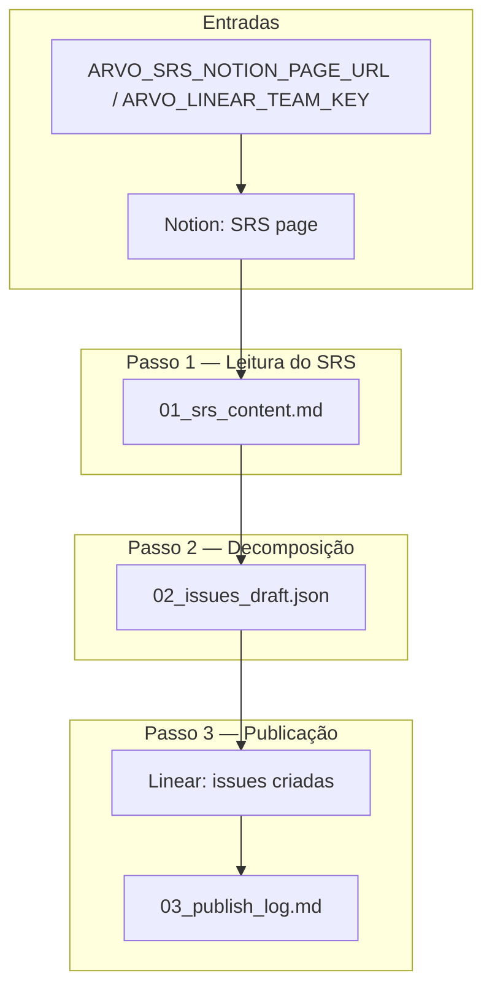

# Crew: decomposição de SRS em issues do Linear (`LinearTasksCreationCrew`)

## Identificação

| Campo | Valor |
| --- | --- |
| **Classe** | `LinearTasksCreationCrew` |
| **Ficheiro** | `src/arvo_auth/engineering/linear_tasks_crew.py` |
| **Configuração** | `src/arvo_auth/engineering/config/linear_tasks_agents.yaml`, `src/arvo_auth/engineering/config/linear_tasks_tasks.yaml` |
| **Processo** | Sequencial |
| **Comando** | `uv run run_linear_tasks` |
| **Entrada em código** | `arvo_auth.main.run_linear_tasks()` |

## Objetivo

Ler um documento SRS armazenado no Notion e transformá-lo numa **árvore hierárquica de issues no Linear**, dimensionada para implementação autónoma por IA:

- **Issue Pai** (label `Feature`) — contexto de negócio completo, fluxo funcional, regras, critérios de aceite.
- **Sub-issues por camada** (`Backend`, `Frontend`, `Infraestrutura`) — cada uma autocontida: a IA que implementa não verá o SRS, apenas o `description` da issue.

Cada sub-issue tem: estimate Fibonacci (máx. 5), `blockedBy` declarados, contrato de API (Backend define; Frontend copia verbatim).

## O que faz

Dois agentes executam **três passos**:

1. **Leitura do SRS** (`srs_issue_architect`) — `fetch_notion_page_text` com a URL da página configurada. Preserva identificadores de requisito (RF-, RNF-, REQ-). Saída: `outputs/engineering/linear_tasks_creation/01_srs_content.md`.

2. **Decomposição** (`srs_issue_architect`) — por módulo do SRS, cria Issue Pai + sub-issues com descrições completas segundo os templates do identity, estima em Fibonacci (≤5, quebra se maior), mapeia `blockedBy`, valida cobertura total de requisitos, ordena topologicamente. Saída: `outputs/engineering/linear_tasks_creation/02_issues_draft.json` (JSON puro, sem fencing).

3. **Publicação no Linear** (`linear_publisher`) — lê o JSON, faz pre-flight `get_team`, cria cada issue via `linear_issue_manager`, resolve `tempId` → ID real sequencialmente, regista o mapa. Saída: `outputs/engineering/linear_tasks_creation/03_publish_log.md`.

### Hierarquia de issues

```
Issue Pai   — Funcionalidade X
  ├── Sub-issue  Backend  — endpoint / serviço / regra          (parentId = Pai)
  ├── Sub-issue  Frontend — UI + integração                     (parentId = Pai)
  └── Sub-issue  Infra    — apenas se necessário                (parentId = Pai)
```

### Regra de estimate

| Pontos | Esforço aproximado |
| --- | --- |
| `2` | Meio dia |
| `3` | ~1 dia |
| `5` | ~2 dias (máximo) |

Acima de 5 → quebrar em múltiplas sub-issues.

## Agentes e ferramentas

| Agente | Ferramentas | Identidade em runtime |
| --- | --- | --- |
| **srs_issue_architect** | `NotionPageReadTool`, `WorkflowOutputReadTool` | `engineering/knowledge/srs_issue_architect_identity.md` |
| **linear_publisher** | `LinearDelegateTool`, `WorkflowOutputReadTool` | `engineering/knowledge/linear_publisher_identity.md` |

### `LinearDelegateTool` — operações

| Operação | Parâmetros principais | Uso |
| --- | --- | --- |
| `get_team` | `team_key` | Verifica que o team existe; retorna UUID |
| `list_labels` | `team_key` | Lista nomes de labels disponíveis |
| `create_issue` | `team_key`, `title`, `description`, `labels`, `priority`, `estimate`, `parent_id`, `blocked_by` | Cria uma issue; retorna ID real (e.g. `TEA-42`) |

`create_issue` delega para `claude -p` com o Linear MCP. `parent_id` e `blocked_by` devem ser IDs reais (nunca `tempId`).

### `read_workflow_artifact` neste crew

Usar sempre `workflow_dir=linear_tasks_creation` e um dos ficheiros:
- `01_srs_content.md`
- `02_issues_draft.json`
- `03_publish_log.md`

## Artefactos necessários para a execução

### Variáveis de ambiente

| Variável | Obrigatório | Descrição |
| --- | --- | --- |
| `ARVO_SRS_NOTION_PAGE_URL` | **Sim** | URL completa da página Dashboard SRS no Notion |
| `ARVO_SRS_NOTION_PAGE_ID` | Legado | UUID (aceito; convertido para URL internamente) |
| `ARVO_LINEAR_TEAM_KEY` | **Sim** | Key do time no Linear (e.g. `NEW`, `TEA`) |
| `ARVO_SRS_PROJECT_NAME` | Não | Nome do projeto (default `Arvo authorization`) |
| `ARVO_LINEAR_DELEGATE_TIMEOUT_SEC` | Não | Timeout do subprocess `claude -p` para criação de issues (default `180`) |
| `CLAUDE_CODE_PERMISSION_MODE` | Recomendado | `bypassPermissions` para que o subprocess não exija aprovação manual |
| `NOTION_API_KEY` | Opcional | Token de API Notion. Se ausente, usa Claude Code CLI com Notion MCP |

### Ficheiros de conhecimento (projeto)

| Ficheiro | Uso |
| --- | --- |
| `src/arvo_auth/engineering/knowledge/srs_issue_architect_identity.md` | Hierarquia, templates de descrição (Issue Pai + Sub-issue), regras de decomposição, antipadrões, formato JSON |
| `src/arvo_auth/engineering/knowledge/linear_publisher_identity.md` | Protocolo de criação sequencial, resolução de tempId, formato do log |

### Infraestrutura

| Requisito | Notas |
| --- | --- |
| **Notion** | `NOTION_API_KEY` ou Claude Code CLI com Notion MCP configurado |
| **Linear MCP** | Configurado no Claude Code (arquivo `~/.claude/settings.json`) com acesso ao workspace |
| **Claude Code CLI** | `claude` instalado e acessível; `CLAUDE_CODE_BIN` se não estiver no `PATH` |
| **LLM** | `default_llm()` — Anthropic API ou `ARVO_LLM_BACKEND=claude_code` |

### Diretório de saída

- `outputs/engineering/linear_tasks_creation/` criado por `run_linear_tasks()` antes do `kickoff`.

## Saídas geradas pelo crew

| Ficheiro | Passo | Conteúdo |
| --- | --- | --- |
| `01_srs_content.md` | 1 | SRS completo do Notion com lista de módulos identificados |
| `02_issues_draft.json` | 2 | JSON array com issues topologicamente ordenadas e tempIds |
| `03_publish_log.md` | 3 | Log de publicação: mapa tempId → ID real, erros |

## Exemplo de execução

```bash
cd arvo_auth_orchestrator

export ARVO_SRS_NOTION_PAGE_URL=https://www.notion.so/35f8c52e53d781c18e24c8b83e8c258e
export ARVO_LINEAR_TEAM_KEY=NEW
export ARVO_SRS_PROJECT_NAME="Arvo authorization"
export CLAUDE_CODE_PERMISSION_MODE=bypassPermissions

uv run run_linear_tasks
```

Após a corrida, verificar `outputs/engineering/linear_tasks_creation/03_publish_log.md` para o mapa de issues criadas.

## Diagrama de fluxo (Mermaid)



## Formato do `02_issues_draft.json`

Array JSON topologicamente ordenado. Exemplo:

```json
[
  {
    "tempId": "F1",
    "title": "Permitir reprovação de solicitação",
    "team": "NEW",
    "labels": ["Feature", "Modulo-Aprovacoes"],
    "priority": 2,
    "parentId": null,
    "blockedBy": [],
    "description": "## Contexto de negócio\n..."
  },
  {
    "tempId": "F1-BE",
    "title": "Criar endpoint POST /solicitacoes/{id}/reprovar",
    "team": "NEW",
    "labels": ["Backend", "Modulo-Aprovacoes"],
    "priority": 2,
    "estimate": 3,
    "parentId": "F1",
    "blockedBy": [],
    "description": "## Objetivo\n..."
  },
  {
    "tempId": "F1-FE",
    "title": "Adicionar botão Reprovar na tela de detalhes",
    "team": "NEW",
    "labels": ["Frontend", "Modulo-Aprovacoes"],
    "priority": 2,
    "estimate": 2,
    "parentId": "F1",
    "blockedBy": ["F1-BE"],
    "description": "## Objetivo\n..."
  }
]
```

`parentId` e `blockedBy` usam `tempId` no draft; o publisher resolve para IDs reais do Linear antes de criar.

## Resolução de problemas

### `get_team` falha com "not found"

- Confirma que `ARVO_LINEAR_TEAM_KEY` é o key correto (não o nome nem o UUID).
- Verifica autenticação do Linear MCP no Claude Code.

### Notion retorna "(empty page)" ou conteúdo truncado

- Confirma que `ARVO_SRS_NOTION_PAGE_URL` é a URL correta da página Dashboard (copie do log de `run_notion_publish`).
- Verifica acesso: `NOTION_API_KEY` com permissão de leitura, ou Notion MCP autenticado.
- Se o SRS usa sub-páginas, o agente deve chamá-las também; verifica `01_srs_content.md`.

### `02_issues_draft.json` inválido ou vazio

- Verifica `01_srs_content.md` — se vazio ou com erro, reexecuta o passo 1.
- Agente pode ter emitido JSON wrapped em fences; o publisher trata isso, mas verifica o ficheiro manualmente.

### Timeout em `create_issue`

- Aumenta `ARVO_LINEAR_DELEGATE_TIMEOUT_SEC` (default 180s).
- Verifica que o Linear MCP está configurado e responde.

### Issue criada sem `parent_id` ou `blocked_by`

- Confirma que o publisher não passou um `tempId` raw nesses campos.
- Verifica `03_publish_log.md` — se um pai falhou na criação, as sub-issues subsequentes podem não ter `parent_id`.

## Relação com outros crews

| Crew | Relação |
| --- | --- |
| `SrsAuthorCrew` | Produz o SRS que este crew consome; executar antes se o SRS ainda não estiver no Notion |
| `FrontendBranchMappingCrew` | Valida o que o frontend expõe entre branches; complementar à fase de QA após as issues serem implementadas |

## Referências no repositório

- Crew: `src/arvo_auth/engineering/linear_tasks_crew.py`
- Tarefas: `src/arvo_auth/engineering/config/linear_tasks_tasks.yaml`
- Agentes: `src/arvo_auth/engineering/config/linear_tasks_agents.yaml`
- Entrada: `src/arvo_auth/main.py` (`run_linear_tasks`, `_build_linear_tasks_inputs`)
- Tool Linear: `src/arvo_auth/core/tools/linear_delegate_tool.py`
- Tool Notion: `src/arvo_auth/core/tools/notion_page_tool.py`
- Tool artefactos: `src/arvo_auth/core/tools/workflow_output_read_tool.py`
- Identidade arquiteto: `src/arvo_auth/engineering/knowledge/srs_issue_architect_identity.md`
- Identidade publisher: `src/arvo_auth/engineering/knowledge/linear_publisher_identity.md`
- Prompt de referência: `~/workspace/autorizador/MD Para quebra de Tasks partindo do SRS.md`
