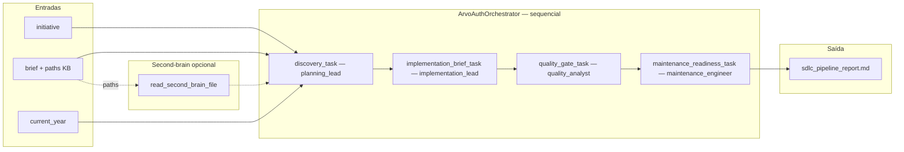

# Crew: pipeline SDLC (`ArvoAuthOrchestrator`)

## Identificação

| Campo | Valor |
| --- | --- |
| **Classe** | `ArvoAuthOrchestrator` |
| **Ficheiro** | `src/arvo_auth_orchestrator/crew.py` |
| **Configuração** | `config/agents.yaml`, `config/tasks.yaml` |
| **Processo** | Sequencial |
| **Comando** | `crewai run` (tipo de projeto CrewAI definido em `pyproject.toml`) |
| **Entrada em código** | `main.run()` — inputs por defeito via env |

## Objetivo

Conduzir uma iniciativa de software desde **descoberta e âmbito** até **prontidão para manutenção**, usando o **second-brain** como fonte de verdade para planos e histórico. O resultado é um **relatório único em Markdown** que desacopla explicitamente **backend (Go)**, **frontend (Next.js)** e **second-brain** (apenas planos e história, sem acoplamento de código entre frontend e backend).

## O que faz

1. **Descoberta (`discovery_task`)** — O *planning lead* lê o briefing e, quando o brief cita caminhos, usa `read_second_brain_file` sob `ARVO_SECOND_BRAIN_ROOT` para cruzar o que já existe no KB com trabalho novo. Produz: contexto, âmbito in/out, dependências, questões abertas e foco de validação.

2. **Brief de implementação (`implementation_brief_task`)** — O *implementation lead* usa só a saída da descoberta como fonte de verdade e propõe workstreams por repositório, sequência, interfaces e notas de rollout, **sem** propor acoplamento arquitetónico direto entre frontend e backend.

3. **Quality gate (`quality_gate_task`)** — O *quality analyst* define testes, verificações manuais, contratos de API quando relevante, e riscos de migração/flags; checklist agrupada por repo e não-objectivos explícitos.

4. **Prontidão para manutenção (`maintenance_readiness_task`)** — O *maintenance engineer* descreve monitorização, rollback, triagem de bugs (ex. Linear) e como futuros agentes devem usar second-brain vs Notion. Saída gravada em **`outputs/sdlc_pipeline_report.md`**.

## Agentes

| Agente | Ferramentas | Papel (resumo) |
| --- | --- | --- |
| **planning_lead** | `SecondBrainReadTool` | Âmbito, riscos e critérios de validação antes da implementação |
| **implementation_lead** | *(nenhuma)* | Outline de implementação respeitando fronteiras dos repos |
| **quality_analyst** | *(nenhuma)* | Gates de qualidade e critérios de aceitação |
| **maintenance_engineer** | *(nenhuma)* | Operação, observabilidade e continuidade pós-merge |

## Artefactos necessários para a execução

### Entrada (kickoff)

Definida em `main._default_inputs()` e passada a `crew().kickoff(inputs=...)`:

| Campo | Origem | Obrigatório | Descrição |
| --- | --- | --- | --- |
| `initiative` | `ARVO_INITIATIVE` | Não | Nome da iniciativa (default de exemplo no código) |
| `brief` | `ARVO_INITIATIVE_BRIEF` | Não | Texto do briefing; pode citar caminhos sob o second-brain |
| `current_year` | Ano atual (sistema) | Automático | Interpolado nas tarefas |

### Variáveis de ambiente

| Variável | Obrigatório | Descrição |
| --- | --- | --- |
| `ARVO_SECOND_BRAIN_ROOT` | Opcional | Raiz do repositório second-brain para `read_second_brain_file` |
| LLM | Sim na prática | `ANTHROPIC_API_KEY` + modelo, ou `ARVO_LLM_BACKEND=claude_code` + CLI `claude` |

### Artefactos no second-brain (opcional mas típico)

Ficheiros ou pastas referenciados no **brief** (ex.: `plans/backend/.../plano.md`, `integracoes/`, `conceitos/`), conforme descrito na tarefa de descoberta.

### Saída gerada pelo crew

| Ficheiro | Descrição |
| --- | --- |
| `outputs/sdlc_pipeline_report.md` | Relatório final do pipeline (última tarefa) |

## Diagrama de fluxo (Mermaid)

## Referências no repositório

- Tarefas: `src/arvo_auth_orchestrator/config/tasks.yaml`
- Agentes: `src/arvo_auth_orchestrator/config/agents.yaml`
- Execução: `src/arvo_auth_orchestrator/main.py` (`run`)
