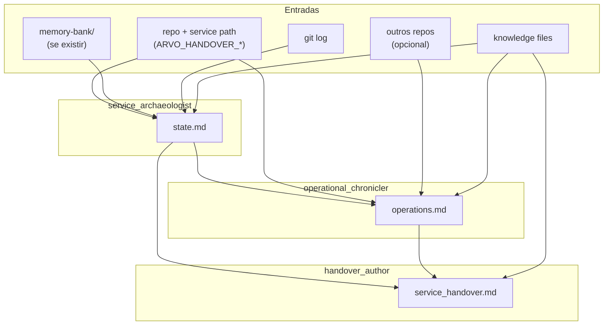

# Crew: handover de serviço (`ServiceHandoverCrew`)

## Identificação

| Campo | Valor |
| --- | --- |
| **Status** | Em construção |
| **Time** | `engineering` (home) — utilizável por qualquer time via import / subclasse |
| **Classe** | `ServiceHandoverCrew` |
| **Ficheiro** | `src/arvo_auth/engineering/service_handover_crew.py` |
| **Configuração** | `engineering/config/handover_agents.yaml`, `engineering/config/handover_tasks.yaml` |
| **Processo** | Sequencial |
| **Comando** | `uv run run_service_handover` |
| **Entrada em código** | `main.run_service_handover()` |

## Objetivo

Para um **serviço específico dentro de um repositório** (em geral um microsserviço de um monorepo), produzir um **`<service>_handover.md`** que sirva de "manual de sobrevivência" para a próxima pessoa que herdar o código — quer seja para mantê-lo, estendê-lo, ou deprecá-lo.

Não é um SRS (que olha para frente). É um **handover** (que olha para o estado presente + decisões abandonadas + dívida tribal).

## Caso de uso disparador

A pausa do projeto **autorizador** (`arvo-auth-intelligence`) cria a necessidade de documentar cada serviço daquele monorepo antes do conhecimento se perder. Mas o crew é genérico: serve para qualquer serviço em qualquer repo configurado (DS pode rodar para `tea-image-analyzer`; engineering pode rodar para `arvo-roots`; etc.).

## O que faz

Três agentes sequenciais:

1. **Arqueologia** (`service_archaeologist`) — Lê o repo e o diretório do serviço; consulta `memory-bank/` (se existir), README, código-fonte, testes, git log; cataloga TODOs/FIXMEs no código, branches abertos, status markers (`FROZEN`, `DEPRECATED`, `WIP`). Produz `<service>_state.md`.
2. **Operações** (`operational_chronicler`) — Lê Dockerfile, configs de deploy (cloud-run yaml, scripts shell), `.env.example`, health endpoints, dashboards mencionados em docs; mapeia consumidores downstream (referências em outros repos configurados). Produz `<service>_operations.md`.
3. **Síntese editorial** (`handover_author`) — Consolida tudo num documento estilo *survival guide* com seções "Se você precisa manter / estender / deprecar". Produz `<service>_handover.md`.

## Agentes

| Agente | Ferramentas | Identidade em runtime |
| --- | --- | --- |
| **service_archaeologist** | `ConfigurableRepoReadTool`, `GitLogReadTool` (nova), `DirectoryListTool` (nova), `BriefingFileReadTool` | `knowledge/handover_archaeologist_identity.md` |
| **operational_chronicler** | `ConfigurableRepoReadTool`, `WorkflowOutputReadTool`, `BriefingFileReadTool` | `knowledge/handover_chronicler_identity.md` |
| **handover_author** | `WorkflowOutputReadTool`, `BriefingFileReadTool` | `knowledge/handover_author_identity.md` + regras em `handover_authoring_rules.md` |

## Tools novas a criar (em `core/tools/`)

| Tool | Para quê | Comportamento |
| --- | --- | --- |
| `GitLogReadTool` | Detectar último toque, autores recentes, branches stale | `git log --no-color -n 20 <path>` via subprocess; aceita `repo` (logical name) + `path` opcional. Read-only. |
| `DirectoryListTool` | Descobrir estrutura do serviço antes de ler arquivos | `os.scandir` recursivo limitado a profundidade 3 e 500 entradas. Read-only, sem `..`. |

## Artefactos necessários para a execução

### Entrada humana / env (kickoff)

| Variável | Obrigatório | Descrição |
| --- | --- | --- |
| `ARVO_HANDOVER_REPO` | Sim | Nome lógico do repo (resolvido via `ARVO_REPO_<NAME>`). Ex.: `intelligence`. |
| `ARVO_HANDOVER_SERVICE` | Sim | Subpath do serviço dentro do repo. Ex.: `services/doc-quality`. |
| `ARVO_HANDOVER_OUTPUT_DIR` | Opcional | Diretório de saída. Default: `outputs/engineering/service_handover/<service-slug>/` |
| `ARVO_HANDOVER_PROJECT_NAME` | Recomendado | Nome do projeto pai (interpolado em prompts). Ex.: `arvo-auth-intelligence`. |
| `ARVO_HANDOVER_STATUS_HINT` | Opcional | Hint sobre lifecycle: `active`, `paused`, `deprecated`, `experimental`. Se vazio, archaeologist tenta inferir. |
| `ARVO_HANDOVER_BRIEFING_MARKDOWN` | Opcional | Markdown extra (links Slack/Notion, último contato, etc.) |
| `ARVO_HANDOVER_RULES_FILE` | Opcional | Override do ficheiro em `knowledge/` (default `handover_authoring_rules.md`) |

CLI também aceita argumentos: `uv run run_service_handover -- intelligence services/doc-quality`.

### Ficheiros de conhecimento (em `engineering/knowledge/`, prefixo `handover_` para migração futura)

| Ficheiro | Uso |
| --- | --- |
| `handover_archaeologist_identity.md` | Voz: forensic engineer; rigor descritivo, anti-especulação |
| `handover_chronicler_identity.md` | Voz: SRE/platform engineer; foco em deploy, observabilidade, contratos |
| `handover_author_identity.md` | Voz: tech writer com viés de futuro mantenedor; honesto sobre incertezas |
| `handover_authoring_rules.md` | Template do `<service>_handover.md` (10 seções), incluindo "Survival Guide" estruturado |

### Infraestrutura

| Requisito | Notas |
| --- | --- |
| LLM | `default_llm()` |
| Repos | Pelo menos `ARVO_REPO_<HANDOVER_REPO>` configurado. Opcionalmente outros para detectar consumidores downstream. |
| git | Disponível no PATH (para `GitLogReadTool`) |

### Saídas geradas pelo crew

| Ficheiro | Passo |
| --- | --- |
| `<output_dir>/state.md` | 1 — inventário factual |
| `<output_dir>/operations.md` | 2 — runbook operacional |
| `<output_dir>/<service-slug>_handover.md` | 3 — artefacto final |

## Estrutura esperada do `<service>_handover.md` final

```
1. TL;DR — Status & Owner (status, último toque, último dono conhecido, 1-parágrafo "o que é")
2. What the service does today (capabilities, endpoints, jobs)
3. Lifecycle & Status (active / paused / deprecated / zombie + razão + data)
4. Architecture in one paragraph (tech stack, key abstractions, link para systemPatterns.md se existir)
5. How to run it (local dev, deploy, env vars, secrets)
6. How to debug it (logs, dashboards, common failure modes)
7. Who consumes it (downstream — outros serviços, pipelines, jobs)
8. Decisions worth preserving (do memory-bank, do código, do git log)
9. Known WIP / abandoned work (branches, FIXMEs, comentados-out)
10. Survival Guide
    - "Se precisar MANTER vivo": passos
    - "Se precisar ESTENDER": onde estão as seams
    - "Se precisar DEPRECAR": consumers a notificar, impacto downstream
11. Open Questions / Unknowns (honestidade sobre o que não está nas fontes)
12. References (paths, links, pessoas/canais quando mencionados)
```

## Diagrama de fluxo (Mermaid)



## Uso por outros times

**Data science (caso disparador)**:
```python
from arvo_auth.engineering.service_handover_crew import ServiceHandoverCrew
ServiceHandoverCrew().crew().kickoff(inputs={...})
```

Ou via CLI direto: `uv run run_service_handover`.

**Subclassing para mudar voz/regras** (ex.: DS quer template diferente):
```python
class DsServiceHandoverCrew(ServiceHandoverCrew):
    agents_config = "config/ds_handover_agents.yaml"  # em data_science/config/
    tasks_config = "config/ds_handover_tasks.yaml"
```

## Trajetória de promoção para `shared/`

Esse crew é o primeiro candidato natural a virar genuinamente shared. Para facilitar uma futura migração:

- Ficheiros de knowledge e config têm **prefixo `handover_`** → selecionáveis por glob no `git mv`.
- Output dir é **parameterizável via env** (`ARVO_HANDOVER_OUTPUT_DIR`) → mudança do default no dia da migração sem quebrar usos existentes.
- Tools (`GitLogReadTool`, `DirectoryListTool`) vão direto para **`core/tools/`** → já compartilhadas, sem migração necessária.

Custo esperado de migração para `shared/`: ~30 minutos mecânicos (mover arquivos + atualizar 1 import + atualizar README).

## Decisões em aberto

| Decisão | Adiada porque |
| --- | --- |
| Detecção automática de consumidores downstream (cross-repo grep) | Pode ser caro em repos grandes; v1 confia em pistas dos READMEs |
| Integração com Slack/Notion para extrair conversas históricas | Aumenta complexidade; pode entrar como v2 via MCP |
| Geração de Mermaid de arquitetura inferido do código | Especulativo; risco de hallucinations; deixar para humano em v1 |
| Output multi-formato (Notion direto, em vez de markdown) | Reusar `SrsNotionPublishCrew` apontando para o artefacto |

## Referências no repositório

- Tarefas: `src/arvo_auth/engineering/config/handover_tasks.yaml`
- Agentes: `src/arvo_auth/engineering/config/handover_agents.yaml`
- Crew: `src/arvo_auth/engineering/service_handover_crew.py`
- Entrada e montagem de inputs: `src/arvo_auth/main.py` (`run_service_handover`, `_build_handover_inputs`)
- Tools novas: `src/arvo_auth/core/tools/git_log_read_tool.py`, `src/arvo_auth/core/tools/directory_list_tool.py`
