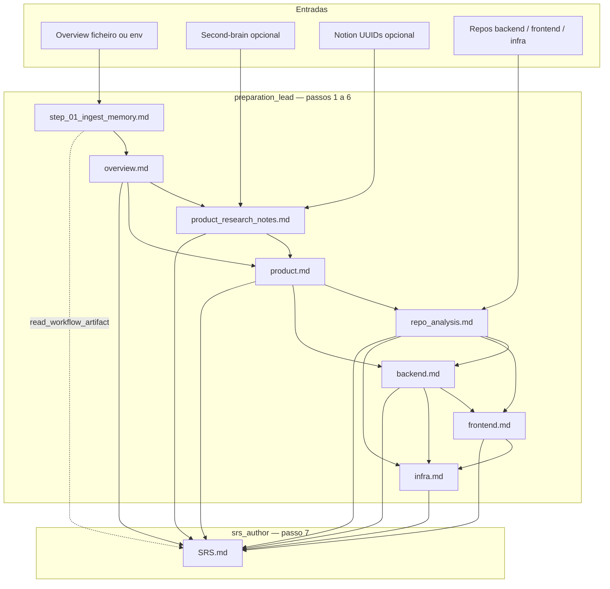

# Crew: autor de SRS (`SrsAuthorCrew`)

## Identificação

| Campo | Valor |
| --- | --- |
| **Classe** | `SrsAuthorCrew` |
| **Ficheiro** | `src/arvo_auth_orchestrator/srs_crew.py` |
| **Configuração** | `config/srs_agents.yaml`, `config/srs_tasks.yaml` |
| **Processo** | Sequencial |
| **Comando** | `uv run run_srs` (pipeline completa); `uv run run_srs_replay` (só a partir de uma tarefa gravada, p.ex. passo 7) |
| **Entrada em código** | `main.run_srs()`, `main.run_srs_replay()` |

## Objetivo

Transformar um **overview de produto** (e fontes opcionais: second-brain, Notion, repositórios) numa cadeia de **memórias intermediárias** consistentes e, no passo final, num **`SRS.md`** único, alinhado a **IEEE 830 / 1012**, taxonomia **RF/RNF**, priorização **MVP vs pós-MVP**, **ATAM** (trade-offs) e rastreabilidade às sete peças de memória em disco.

## O que faz

O crew corre **sete passos de preparação** (agente *Context Synthesizer* / `preparation_lead`) e **um passo de autoría formal** (`srs_author`):

1. **Ingestão** — Estrutura o overview bruto em `step_01_ingest_memory.md` (secções XML-like densas).
2. **Overview canónico** — `overview.md` reconciliado com o passo 1.
3. **Pesquisa alargada** — `product_research_notes.md` com second-brain e Notion (UUIDs).
4. **Produto consolidado** — `product.md` deduplicado com tabela de rastreio a fontes.
5. **Análise de código** — `repo_analysis.md` via leitura dos repos backend/frontend/infra.
6. **Snapshots** — `backend.md`, `frontend.md`, `infra.md` só com factos lidos dos repos.
7. **SRS final** — `SRS.md` lendo **obrigatoriamente** os sete ficheiros anteriores do disco via `read_workflow_artifact`; regras suplementares vêm de `{srs_authoring_rules}` (ficheiro `knowledge/srs_authoring_rules.md` por defeito).

## Agentes

| Agente | Ferramentas | Identidade em runtime |
| --- | --- | --- |
| **preparation_lead** (Context Synthesizer) | `SecondBrainReadTool`, `NotionPageReadTool`, `BriefingFileReadTool`, `RepoReadTool`, `WorkflowOutputReadTool` | `knowledge/context_synthesizer_identity.md` (append ao backstory) |
| **srs_author** | `WorkflowOutputReadTool`, `BriefingFileReadTool` | `knowledge/srs_author_identity.md` + regras na tarefa |

## Artefactos necessários para a execução

### Entrada humana / env (kickoff)

| Artefacto / variável | Obrigatório | Descrição |
| --- | --- | --- |
| `ARVO_SRS_OVERVIEW_FILE` **ou** `ARVO_SRS_PRODUCT_OVERVIEW` | Sim (recomendado ficheiro) | Overview de produto: path para `.md` ou texto inline |
| `ARVO_SRS_BRIEFING_MARKDOWN` | Opcional | Markdown extra anexado ao overview |
| `ARVO_SRS_RULES_FILE` | Opcional | Nome do ficheiro em `knowledge/` (default `srs_authoring_rules.md`) |
| `NOTION_PAGE_IDS` | Opcional | UUIDs (separados por espaço ou vírgula) para `fetch_notion_page_text` no passo 3 |
| `NOTION_API_KEY`, `NOTION_VIA_CLAUDE_CODE` | Opcional | REST vs delegação ao CLI para leitura Notion |
| `ARVO_SECOND_BRAIN_ROOT` | Opcional | Raiz do second-brain (default: irmão do orchestrator) |
| `ARVO_BACKEND_REPO_ROOT`, `ARVO_FRONTEND_REPO_ROOT`, `ARVO_INFRA_REPO_ROOT` | Opcional | Overrides das raízes dos repos para `read_repo_file` |
| `ARVO_SRS_PROJECT_NAME`, `ARVO_SRS_PHASE` | Opcional | Interpolação em YAML (defaults em `main.run_srs`) |
| `ARVO_SRS_REPLAY_TASK_ID` | Opcional | Só para `uv run run_srs_replay`: UUID da tarefa `author_srs_task` (alternativa: passar o UUID como primeiro argumento ao script) |

### Ficheiros de conhecimento (projeto)

| Ficheiro | Uso |
| --- | --- |
| `knowledge/context_synthesizer_identity.md` | Identidade do preparador |
| `knowledge/srs_author_identity.md` | Identidade do autor do SRS |
| `knowledge/<ARVO_SRS_RULES_FILE ou srs_authoring_rules.md>` | Regras suplementares injetadas na tarefa 7 |

### Infraestrutura

| Requisito | Notas |
| --- | --- |
| LLM | `default_llm()` — API Anthropic ou `ARVO_LLM_BACKEND=claude_code` + CLI `claude` |
| Repos | Pastas apontadas por env ou defaults (`arvo-auth`, `arvo-auth-frontend`, …) acessíveis para leitura |
| Notion (opcional) | MCP no Claude Code se delegar leituras sem API |

### Diretório de saída

- `outputs/srs_workflow/` criado por `run_srs()` antes do `kickoff`.

### Saídas geradas pelo crew (artefactos em disco)

| Ficheiro | Passo |
| --- | --- |
| `outputs/srs_workflow/step_01_ingest_memory.md` | 1 |
| `outputs/srs_workflow/overview.md` | 2 |
| `outputs/srs_workflow/product_research_notes.md` | 3 |
| `outputs/srs_workflow/product.md` | 4 |
| `outputs/srs_workflow/repo_analysis.md` | 5 |
| `outputs/srs_workflow/backend.md` | 6a |
| `outputs/srs_workflow/frontend.md` | 6b |
| `outputs/srs_workflow/infra.md` | 6c |
| `outputs/srs_workflow/SRS.md` | 7 |

## Diagrama de fluxo (Mermaid)

## Replay só do passo 7 (`SRS.md`)

O CrewAI persiste as saídas das tarefas do último `kickoff` em SQLite (`latest_kickoff_task_outputs.db`, ver documentação CrewAI sobre `replay`). Podes **reexecutar apenas a tarefa final** (e tarefas posteriores, se existirem) sem voltar a correr os passos 1–6, desde que:

1. Tenhas corrido pelo menos uma vez **`uv run run_srs`** com sucesso **nesta máquina** (ou o mesmo ficheiro de base de dados CrewAI), para as saídas dos passos 1–6 estarem gravadas.
2. O registo em SQLite corresponda **a este crew** — se correres outro `kickoff` de outro crew a seguir, o conteúdo de `crewai log-tasks-outputs` pode deixar de alinhar com as tarefas do `SrsAuthorCrew`; nesse caso volta a correr `uv run run_srs` antes do replay.

**Não confundir IDs:** no fim do `kickoff`, o resumo **Crew Execution Completed** mostra um **ID do crew** (por vezes junto ao nome `SrsAuthorCrew`). Esse valor **não** serve para `replay`. O `replay` só aceita o **`task_id`** de cada tarefa, tal como aparece na saída de **`crewai log-tasks-outputs`** (última linha = passo 7 / `author_srs_task`).

**Passos:**

1. Na raiz de `arvo_auth_orchestrator`, após um `run_srs` completo: `crewai log-tasks-outputs` e copia o **`task_id`** da última linha (tarefa `author_srs_task` / passo 7).
2. Mantém as mesmas variáveis de ambiente que usarias para `run_srs` (overview, regras, fase, etc.) — o `replay` usa `main._build_srs_inputs()` para interpolar descrições e manter consistência.
3. Corre **um** dos seguintes:
   - `ARVO_SRS_REPLAY_TASK_ID=<uuid> uv run run_srs_replay`
   - `uv run run_srs_replay -- <uuid>`

O `replay` reutiliza as saídas gravadas das tarefas anteriores como contexto e volta a executar a partir da tarefa indicada, regenerando `outputs/srs_workflow/SRS.md`.

**Nota:** o comando global `uv run replay` / `main.replay` do projeto aponta para o crew **SDLC** (`ArvoAuthOrchestrator`), não para o SRS. Para o fluxo SRS usa sempre **`run_srs_replay`**.

### Timeout do Claude Code (`claude -p`) no passo 7 ou no replay

Cada invocação do agente em modo **`ARVO_LLM_BACKEND=claude_code`** (ou sem API key) corre um subprocesso `claude -p` com limite de tempo. Se o SRS for grande, o passo 7 ou um `run_srs_replay` pode exceder esse limite e o ficheiro fica incompleto ou com mensagem de timeout.

1. Define **`ARVO_CREWAI_CLAUDE_CODE_TIMEOUT_SEC`** no `.env` (segundos), por exemplo `7200` ou `10800` para corridas muito longas. Se estiver vazio, usa-se `NOTION_CLAUDE_DELEGATE_TIMEOUT_SEC`; se ambos vazios, o código usa um **default de 3600 s** (1 h) por chamada em `ClaudeCodeLLM`.
2. Alternativa: usar **`ARVO_LLM_BACKEND=anthropic`** com **`ANTHROPIC_API_KEY`** — o CrewAI fala com a API HTTP (sem esse timeout de subprocesso por passo).

### Claude Code recusa escrever `SRS.md` (“don’t ask mode”, Write bloqueado)

Se `SRS.md` contiver texto sobre **Write permission denied** ou **don’t ask mode**, o subprocesso `claude -p` estava com **`CLAUDE_CODE_PERMISSION_MODE=dontAsk`** (só ferramentas pré-aprovadas; escritas bloqueadas).

1. No `.env`, usa **`CLAUDE_CODE_PERMISSION_MODE=acceptEdits`** (ou `default` se preferires só leitura e o modelo **não** tentar Write — o ideal é o autor devolver só o markdown na resposta; ver `srs_author_identity.md`). Para ambientes isolados (VM), a documentação do Claude Code menciona modos mais permissivos; evita `dontAsk` para este crew se precisares de escrita via CLI.
2. O default no código (`notion_claude_delegate.run_claude_code_print`) passou a **`acceptEdits`** quando a variável não está definida — mas se o teu `.env` ainda fixa `dontAsk`, remove ou altera essa linha.

### `Argument list too long` ao invocar Claude Code (devcontainer / Linux)

**Sintoma:** `ERROR: Failed to run Claude Code: [Errno 7] Argument list too long: '/home/vscode/.local/bin/claude'`.

**Causa:** versões antigas passavam o prompt inteiro (contexto do SRS, histórico ReAct, etc.) como argumento de linha de comando. No Linux o tamanho total de `argv` + `environ` é limitado (`ARG_MAX`); devcontainers com muitas variáveis de ambiente agravam o problema.

**Correção:** `run_claude_code_print` envia o prompt por **stdin** (`claude -p` com pipe), não em `argv`. Atualiza o repositório e volta a correr o flow. Se ainda falhar, confirma que `claude --help` menciona `-p` com suporte a pipes e que `CLAUDE_CODE_BIN` aponta para o binário correto.

## Resolução de problemas

### Artefactos em `outputs/srs_workflow/` parecem cortados (só o fim do ficheiro)

**Causa:** o CrewAI, em modo ReAct, grava em `output_file` apenas o campo `output` do `AgentFinish`. O parser padrão derivava esse texto com `split("Final Answer:")[-1]`. Se o markdown do artefacto contiver a substring literal `Final Answer:` (por exemplo em requisitos de UI ou exemplos de cópia), tudo **antes da última** ocorrência era descartado.

**Correção no projeto:**

1. **`crewai_react_parse_fix.py`** (ativado ao importar `llm_defaults`) — corrige o `split("Final Answer:")[-1]` quando há várias ocorrências e tenta cortar após o primeiro marcador estruturado (`\nFinal Answer:\n`, etc.).
2. **`ClaudeCodeLLM`** — não aplica `_apply_stop_words` ao texto do `claude -p` e reporta `supports_stop_words() == False`, porque o CrewAI acrescenta `\nObservation:` a `llm.stop` e isso podia truncar SRS que repetem o formato ReAct no corpo.
3. **Identidades** — `knowledge/context_synthesizer_identity.md` e `knowledge/srs_author_identity.md` pedem para não usar `Final Answer:` solto no markdown e para colocar o **SRS completo** após a linha `Final Answer:`, não só em `Thought:`.

Depois de atualizar o código, volta a executar `uv run run_srs` para regenerar os artefactos.

## Referências no repositório

- Tarefas: `src/arvo_auth_orchestrator/config/srs_tasks.yaml`
- Agentes: `src/arvo_auth_orchestrator/config/srs_agents.yaml`
- Entrada e montagem de inputs: `src/arvo_auth_orchestrator/main.py` (`run_srs`, `_build_srs_inputs`, `run_srs_replay`)
