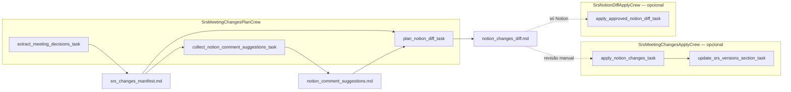

# Crew: atualização do SRS a partir de transcrição + comentários Notion

## Identificação

| Campo | Valor |
| --- | --- |
| **Classes** | `SrsMeetingChangesPlanCrew` (fase plano), `SrsMeetingChangesApplyCrew` (aplicar + Versões, opcional), `SrsNotionDiffApplyCrew` (só aplicar diff, opcional) |
| **Ficheiro** | `src/arvo_auth_orchestrator/srs_meeting_update_crew.py` · `src/arvo_auth_orchestrator/srs_notion_diff_apply_crew.py` |
| **Configuração** | `config/srs_meeting_update_agents.yaml`, `config/srs_meeting_update_plan_tasks.yaml`, `config/srs_meeting_update_apply_tasks.yaml` · `config/srs_notion_diff_apply_agents.yaml`, `config/srs_notion_diff_apply_tasks.yaml` |
| **Processo** | Sequencial em cada crew |
| **Comandos** | `uv run run_srs_meeting_update` (termina com o diff) · `uv run run_srs_notion_diff_apply` · `uv run run_srs_meeting_update_apply` |
| **Entradas em código** | `main.run_srs_meeting_update()` · `main.run_srs_notion_diff_apply()` · `main.run_srs_meeting_update_apply()` |

## Objetivo

Combinar **decisões da transcrição** (`D-*`, só texto da transcrição) com **sugestões extraídas dos comentários** de todas as páginas e sub-páginas Notion sob a raiz configurada (`C-*`, inventário + threads via MCP). O **plano** não lê `SRS.md`, `publish_plan.md`, `publish_execution_log.md`, `gaps_and_open_questions.md` nem outros outputs de crews externos — apenas o ficheiro de transcrição e o Notion (corpo + comentários). O **diff** (`notion_changes_diff.md`) usa **URLs tiradas exclusivamente** da tabela `## Inventário de páginas (Notion)` do relatório de comentários.

## O que faz

### Fase plano — `SrsMeetingChangesPlanCrew` (`uv run run_srs_meeting_update`)

1. **Task 1 — `extract_meeting_decisions_task`**  
   Só `read_meeting_transcript`. Saída: `outputs/srs_meeting_update/srs_changes_manifest.md` (tabela `D-id | …` com âncoras evidenciadas na transcrição).

2. **Task 2 — `collect_notion_comment_suggestions_task`**  
   Uma chamada a `notion_collect_srs_page_comments_via_claude` (subprocesso MCP a partir da raiz Notion; sem ler logs de publicação nem lacunas em disco).  
   Saída: `outputs/srs_meeting_update/notion_comment_suggestions.md` (saída do tool + `## Síntese do agente`).

3. **Task 3 — `plan_notion_diff_task`**  
   Usa o **contexto** das tarefas 1 e 2 (sem ferramentas de leitura de artefactos de publish/workflow). Funde `D-*` e `C-*` em `outputs/srs_meeting_update/notion_changes_diff.md` com `[D-…]` / `[C-…]`. **Sem** anexo de atualização a `gaps_and_open_questions.md`.

O `main.run_srs_meeting_update()` imprime caminhos e pré-visualizações (comentários + diff) e **termina**.

### Fase aplicar (completa) — `SrsMeetingChangesApplyCrew` (`uv run run_srs_meeting_update_apply`)

4. **`apply_notion_changes_task`** — `notion_apply_srs_changes_via_claude` (MCP).  
5. **`update_srs_versions_section_task`** — `srs_versions_local_update` + `notion_update_versions_section_via_claude`.

### Aplicar só o diff (sem Versões) — `SrsNotionDiffApplyCrew` (`uv run run_srs_notion_diff_apply`)

Crew **separado** com uma tarefa: executa apenas `notion_apply_srs_changes_via_claude` sobre `notion_changes_diff.md` e grava `diff_apply_execution_log.md`. Documentação: [crew-srs-notion-diff-apply.md](crew-srs-notion-diff-apply.md).

## Agente

| Agente | Ferramentas (Plan) | Ferramentas (Apply) |
| --- | --- | --- |
| **srs_change_steward** | `read_meeting_transcript`, **`notion_collect_srs_page_comments_via_claude`** | `read_meeting_update_artifact`, `notion_apply_srs_changes_via_claude`, `notion_update_versions_section_via_claude`, `srs_versions_local_update` |

Identidade: `knowledge/srs_meeting_change_steward_identity.md`.

## Variáveis de ambiente

| Variável | Obrigatório | Descrição |
| --- | --- | --- |
| `ARVO_MEETING_TRANSCRIPT_FILE` | Sim (fase plano) | Transcrição |
| `NOTION_SRS_PARENT_PAGE_ID` / `NOTION_SRS_PARENT_URL` | Sim | Raiz Notion (varredura de comentários + apply) |
| `NOTION_COMMENT_SCAN_CLAUDE_TIMEOUT_SEC` | Opcional | Timeout da varredura de comentários (default 3600 s) |
| `ARVO_MEETING_UPDATE_NEXT_VERSION` | Opcional | Versão no cabeçalho do diff |
| `NOTION_APPLY_CHANGES_CLAUDE_TIMEOUT_SEC` | Opcional | Apply (default 1800 s) |
| `NOTION_VERSIONS_UPDATE_CLAUDE_TIMEOUT_SEC` | Opcional | Página Versões (default 600 s) |

Removidos do fluxo predefinido: loop interactivo de aprovação, `ARVO_MEETING_UPDATE_MAX_REVISIONS`, `ARVO_MEETING_UPDATE_AUTO_APPROVE`.

## Saídas

| Ficheiro | Descrição |
| --- | --- |
| `outputs/srs_meeting_update/srs_changes_manifest.md` | Decisões `D-*` |
| `outputs/srs_meeting_update/notion_comment_suggestions.md` | Comentários → `C-*` + inventário de páginas |
| `outputs/srs_meeting_update/notion_changes_diff.md` | Diff unificado (**fim do fluxo predefinido**) |
| `outputs/srs_meeting_update/diff_apply_execution_log.md` | Só após `run_srs_notion_diff_apply` (apply Notion sem Versões) |
| `outputs/srs_meeting_update/apply_execution_log.md` | Só após `run_srs_meeting_update_apply` |
| `outputs/srs_meeting_update/versions_update_log.md` | Idem |

## Diagrama (Mermaid)

Ver também: [crew-srs-notion-diff-apply.md](crew-srs-notion-diff-apply.md).

## Referências

- Tool de comentários: `src/arvo_auth_orchestrator/tools/notion_collect_page_comments_claude_tool.py`
- Plano (second-brain): `second-brain/plans/backend/arvo-auth-orchestrator/crew-srs-meeting-update.md`
