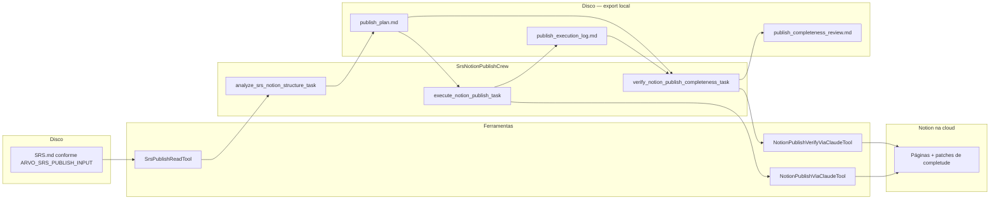

# Crew: publicação SRS no Notion (`SrsNotionPublishCrew`)

## Identificação

| Campo | Valor |
| --- | --- |
| **Classe** | `SrsNotionPublishCrew` |
| **Ficheiro** | `src/arvo_auth_orchestrator/notion_publish_crew.py` |
| **Configuração** | `config/notion_publish_agents.yaml`, `config/notion_publish_tasks.yaml` |
| **Processo** | Sequencial |
| **Comando** | `uv run run_notion_publish` |
| **Entrada em código** | `main.run_notion_publish()` |

## Objetivo

Publicar o conteúdo de **`SRS.md`** no Notion com **exportação sem perda** (corpo completo por secção, sem resumos), **hierarquia guiada pelo TOC** (Dashboard + uma sub-página por secção do sumário), revisão final automática que compara o ficheiro com as páginas criadas e **corrige lacunas** via MCP — **sem** API REST no crew.

## O que faz

1. **Passo A — Análise e plano**  
   O agente lê o SRS (`read_srs_for_notion_publish`), extrai o **sumário (TOC)** (ou infere a partir dos títulos de primeiro nível), e desenha uma **árvore concreta**: raiz do utilizador → **Dashboard** → **uma página filha por secção do TOC** (títulos com numeração do SRS), mapeamento secção → página, e lista de citações onde existem URLs a ligar. A saída é gravada em `outputs/notion_export/publish_plan.md`. Não cria páginas ainda.

2. **Passo B — Execução**  
   Invoca **uma vez** `notion_publish_srs_via_claude`: instruções exigem cópia **integral** do markdown de cada secção (parágrafos, listas, tabelas, blocos de código) para as páginas Notion correspondentes; divisão em páginas «continued» se necessário.

3. **Passo C — Revisão de completude**  
   Invoca **uma vez** `notion_verify_srs_publish_completeness_via_claude`: releitura do `SRS.md`, do plano e do registo B; comparação com as páginas Notion via MCP; **correção** de conteúdo em falta. Saída em `outputs/notion_export/publish_completeness_review.md` (`COMPLETE_OK` / `COMPLETE_GAPS_FIXED` / `COMPLETE_FAILED`).

## Agente

| Agente | Ferramentas | Papel |
| --- | --- | --- |
| **notion_architect** | `SrsPublishReadTool`, `NotionPublishViaClaudeTool`, `NotionPublishVerifyViaClaudeTool` | Planear, publicar e auditar; identidade: `knowledge/notion_architect_identity.md` |

## Artefactos necessários para a execução

### Entrada obrigatória

| Artefacto | Descrição |
| --- | --- |
| **Ficheiro SRS** | Por defeito `outputs/srs_workflow/SRS.md` relativo à raiz do projeto; override com `ARVO_SRS_PUBLISH_INPUT` (path absoluto ou relativo à raiz do pacote) |

O SRS deve existir e ser o resultado desejado para publicação (tipicamente após `uv run run_srs`).

### Variáveis de ambiente

| Variável | Obrigatório | Descrição |
| --- | --- | --- |
| `NOTION_SRS_PARENT_URL` | Sim | URL completa da página pai no Notion |
| `NOTION_SRS_PARENT_PAGE_ID` | Legado | UUID (aceito; convertido para URL internamente) |
| `NOTION_PUBLISH_CLAUDE_TIMEOUT_SEC` | Opcional | Timeout do subprocesso do passo B (default 1800 s) |
| `NOTION_PUBLISH_VERIFY_CLAUDE_TIMEOUT_SEC` | Opcional | Timeout do subprocesso do passo C — auditoria / patches (default 3600 s) |
| `ARVO_CLAUDE_CODE_CWD`, `CLAUDE_CODE_BIN`, `CLAUDE_CODE_PERMISSION_MODE`, `CLAUDE_CODE_EXTRA_ARGS` | Opcional | Alinhados à delegação `claude -p` |

### Infraestrutura

| Requisito | Notas |
| --- | --- |
| **Claude Code CLI** | `claude` no PATH ou `CLAUDE_CODE_BIN` |
| **MCP Notion** | Configurado no Claude Code como no uso interativo (o crew não usa `NOTION_API_KEY` para criar páginas) |
| LLM do agente | Mesmo mecanismo `default_llm()` que os outros crews (passos A/B/C em sequência) |

### Pastas

- `outputs/notion_export/` criada por `run_notion_publish()` se não existir.

### Saídas geradas pelo crew

| Ficheiro | Descrição |
| --- | --- |
| `outputs/notion_export/publish_plan.md` | Plano de árvore Notion (passo A) |
| `outputs/notion_export/publish_execution_log.md` | Registo de execução (passo B; inclui saída do tool) |
| `outputs/notion_export/publish_completeness_review.md` | Relatório de auditoria pós-publicação (passo C) |

As páginas Notion em si ficam no workspace Notion do utilizador, não no disco local.

## Diagrama de fluxo (Mermaid)

## Referências no repositório

- Tarefas: `src/arvo_auth_orchestrator/config/notion_publish_tasks.yaml`
- Agentes: `src/arvo_auth_orchestrator/config/notion_publish_agents.yaml`
- Tool de publicação: `src/arvo_auth_orchestrator/tools/notion_publish_claude_tool.py`
- Tool de auditoria: `src/arvo_auth_orchestrator/tools/notion_publish_verify_claude_tool.py`
